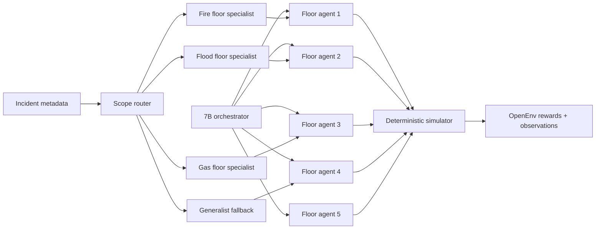

# EvacOS2: Training LLM Agents To Coordinate Real Evacuations

EvacOS2 is an OpenEnv-compatible reinforcement-learning environment for one of the places where agentic AI should be tested hardest: emergency coordination. Instead of asking a model to write a plausible evacuation plan in one message, EvacOS2 places a hierarchy of agents inside a deterministic building simulator. Hazards evolve. Exits bottleneck. Floor agents see only local state. A building-level orchestrator has to coordinate priorities across floors. Every action is checked by the environment.

That makes the project different from a normal chatbot demo. The model cannot win by sounding confident. It has to act, observe consequences, and improve against programmatic rewards.

GitHub: [https://github.com/sai-shashankN/EvacOS2](https://github.com/sai-shashankN/EvacOS2)

Hugging Face Space: [https://huggingface.co/spaces/shashankN777/evacos2-openenv](https://huggingface.co/spaces/shashankN777/evacos2-openenv)

## The Core Idea

Most LLM evaluation still happens in prompt-response form. That is useful, but it misses a large part of what agents need to do in the world: maintain state, delegate work, react to partial observations, and make decisions whose consequences unfold over time.

EvacOS2 turns that into a trainable environment. The simulator creates a multi-floor building with civilians, rooms, corridors, stairwells, elevators, exits, local hazards, and global coordination pressure. The system then asks a hierarchy of LLM policies to evacuate civilians while minimizing invalid actions, congestion, and casualties.

The novelty is the combination:

- A deterministic emergency simulator with multi-agent roles.
- An OpenEnv API that judges can pull and run directly.
- A role-aware training stack for shared policies, split-role policies, and specialist floor responders.
- Verifiable evaluation with scorecards and plots instead of hand-picked examples.
- A realistic routing layer where incident metadata selects the right specialist lane, while a larger orchestrator remains available for cross-floor conflicts and outliers.

In practical terms, EvacOS2 is a benchmark for whether LLM post-training can make agents better at coordinated action, not just better at explanation.

## Why Evacuation Is A Strong Testbed

Emergency response is naturally multi-agent. A floor responder may know which rooms are blocked locally, but not whether another floor has already saturated the stairwell. A building coordinator may know that one exit is overloaded, but not every local hazard detail. Good behavior requires both local speed and global judgment.

That is exactly the kind of structure hierarchical agents should learn:

- **Partial observability:** floor agents see local rooms, civilians, hazards, exits, and active directives.
- **Long-horizon consequences:** an early route choice can create a later bottleneck.
- **Coordination pressure:** the orchestrator must allocate scarce exits, override bad local plans, and broadcast directives.
- **Verifiable outcomes:** the simulator can score saved civilians, invalid actions, losses, and progress.

This matters because many agent benchmarks reward verbal correctness. EvacOS2 rewards operational correctness.

## Architecture

The environment uses a `1 + 5` hierarchy: one orchestrator supervises five floor agents.



The design is intentionally pragmatic. The `3B` floor specialists are the fast responders. They handle local routing decisions quickly. The `7B` orchestrator is not meant to replace them; it is the slower global coordinator that can reason about building-wide priorities, cross-floor conflicts, stalled evacuations, and weird edge cases.

That mirrors how real emergency systems work. Fire alarms, moisture or water sensors, gas detectors, facility reports, and dispatch metadata can identify the broad incident family before an AI policy acts. EvacOS2 uses that already-known incident context to route the local floor policy deterministically. The larger orchestrator then focuses on coordination rather than wasting capacity guessing the disaster type.

## OpenEnv Surface

EvacOS2 exposes the standard OpenEnv-style endpoints:

- `/openenv/health`
- `/openenv/metadata`
- `/openenv/schema`
- `/openenv/reset`
- `/openenv/step`
- `/openenv/state`

The Hugging Face Space is the canonical live environment surface. The same API shape is used by the training and evaluation code, so the demo is not a separate toy wrapper.

## Training Stack

The training stack is built for hackathon practicality:

- **OpenEnv** standardizes the environment boundary.
- **TRL / GRPO-style optimization** handles RL post-training.
- **Unsloth + LoRA** keeps fine-tuning affordable.
- **Checkpoint-local metrics** make it easier to inspect progress over time.
- **Fixed-suite evaluation** reports clean baseline-vs-trained comparisons.

GRPO is a good fit here because the environment provides verifiable reward signals and we need a lighter path than PPO-style setups. Unsloth helps keep the memory and runtime budget realistic. LoRA adapters let us preserve checkpoints without uploading full model copies.

## Reward Design

The reward is deliberately not one vague scalar. EvacOS2 combines several signals:

- civilians saved or lost
- movement progress through the building
- invalid-action penalties
- floor-level routing quality
- orchestrator directive quality
- override quality
- belief and prediction checks

Training reward and judge-facing evaluation are kept separate. Training rewards can remain normalized and contrastive for GRPO, while evaluation reports bounded, readable metrics such as valid-action score, invalid-action rate, saved civilians, and baseline-vs-trained deltas.

That separation matters. A messy reward curve may still be useful for optimization, but a judge should see a finite scorecard and a plot they can understand in seconds.

## Evidence So Far

The cleanest completed evidence is the `3B` floor-specialist canary suite across fire, flood, and gas response lanes. These short runs are not presented as final convergence. They are proof that the environment, training, checkpointing, and metrics pipeline are live end to end.

| Specialist | Start valid-action score | Trained checkpoint score | Delta | Last-10 invalid rate | Last-10 GRPO reward std |
|---|---:|---:|---:|---:|---:|
| Fire `3B` | `83.65%` | `96.54%` | `+12.89 pp` | `3.46%` | `0.7168` |
| Flood `3B` | `88.46%` | `97.54%` | `+9.08 pp` | `2.46%` | `1.3848` |
| Gas `3B` | `89.62%` | `97.13%` | `+7.51 pp` | `2.87%` | `0.9769` |

`valid-action score = 100 * (1 - invalid_action_rate)`. The start score is step `0`; the trained checkpoint score is the last-10 average ending at checkpoint `ckpt_49`.


The important result is not only that the score improves. It is that the system produces the full artifact chain: rollouts, rewards, checkpoints, metrics, plots, and reproducible evaluation scripts.

## Why The 7B Orchestrator Matters

The `7B` orchestrator is the future-proofing layer. If every scenario were routine, specialist floor responders would be enough. Real incidents are not always routine.

The orchestrator exists for:

- global evacuation priorities
- cross-floor bottlenecks
- conflicting local recommendations
- stalled evacuations
- uncertainty in incident reports
- fallback when a specialist lane is not appropriate
- human-review summaries and escalation notes

This creates a path toward self-healing multi-agent coordination. A local specialist can act quickly; a larger coordinator can notice anomalies, redirect policy choices, request explanations, and escalate cases where the normal route fails. That is a more realistic architecture than a single monolithic model trying to do every decision at every speed.

The public behavior card for this layer is [demo/results/7b_orchestrator_behavior_card.md](demo/results/7b_orchestrator_behavior_card.md). Its status is intentionally precise: the `7B/3B` split-role path is smoke/training-signal validated and checkpoints role-specific adapters, but final held-out `7B` orchestrator convergence is still the next evaluation target.

## What Makes This Submission Novel

EvacOS2 is not trying to be another grid-world clone. The point is to test a capability gap that matters: can LLM agents coordinate under constrained, evolving, partially observable conditions and get measurably better from RL?

The strongest parts of the submission are:

- **Operational realism:** alarms and sensor metadata route the response lane before model action.
- **Multi-agent hierarchy:** local agents and global coordinator have different jobs.
- **Trainability:** the environment is wired into an actual GRPO/LoRA pipeline.
- **Verifiability:** the evaluator produces scorecards and plots.
- **Extensibility:** the same framework can support specialist responders, a generalist fallback, and larger orchestrator training.
- **OpenEnv compliance:** the environment is exposed through a standard runnable API instead of private scripts.

The result is a serious environment for agent post-training: ambitious enough to be interesting, but concrete enough to run, score, and debug.

## How To Reproduce The Evidence

Baseline evidence can be regenerated without a GPU:

```bash
python -m evaluation.demo_bundle --skip-trained --output-dir outputs/demo_bundle_baseline
```

The checked-in notebook and training configs show the GPU training path with TRL, Unsloth, and LoRA. For trained comparisons, restore a selected adapter checkpoint and run:

```bash
CHECKPOINT_DIR=/path/to/downloaded/lora_adapter
python -m evaluation.demo_bundle \
  --trained-checkpoint "$CHECKPOINT_DIR" \
  --config training/config.remote-unsloth-7b3b-split-bridge.yaml \
  --output-dir outputs/demo_bundle
```

The public Space exposes the OpenEnv endpoints so reviewers can inspect the environment contract directly.

## Closing

EvacOS2 is built around a simple belief: LLM agents should be evaluated where their actions matter. Emergency evacuation is a domain where coordination, uncertainty, and delayed consequences all show up naturally. That makes it a strong setting for reinforcement learning with verifiable environments.

The current submission demonstrates a runnable OpenEnv environment, an end-to-end training pipeline, specialist checkpoint evidence, and a scalable path toward `7B` orchestration over fast local responders. It is a foundation for training agents that do not merely describe plans, but improve at acting inside a changing world.
