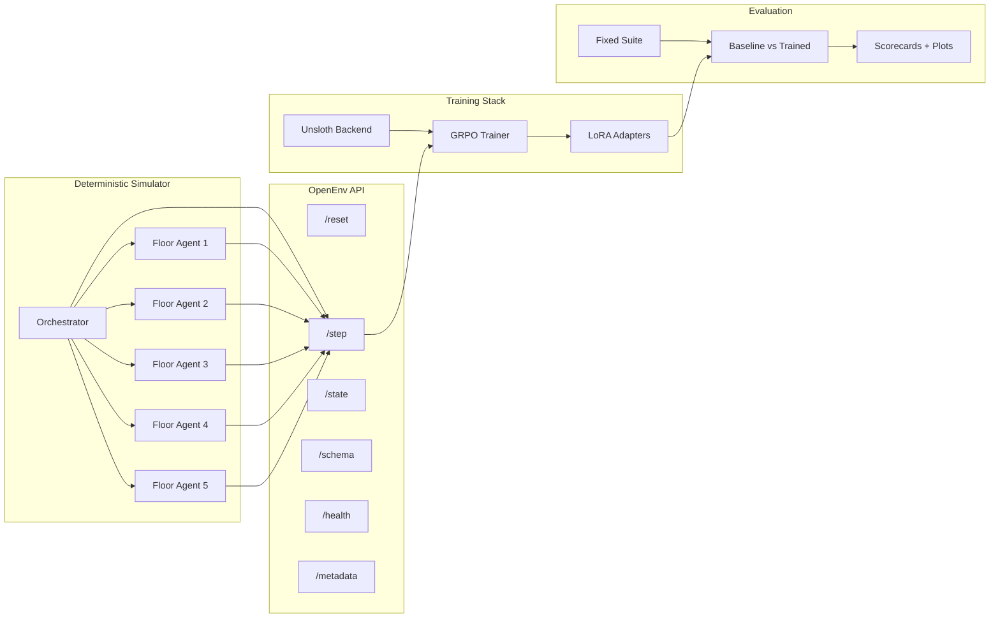

# EvacOS2

**OpenEnv-compatible hierarchical multi-agent evacuation benchmark — deterministic simulator, role-aware GRPO, baseline-to-scorecard evaluation.**

## Judge-Fast Summary

| Aspect | Detail |
|---|---|
| **Domain** | Emergency building evacuation under uncertainty, constrained exits, and evolving hazards |
| **Topology** | `1` orchestrator agent + `5` floor agents |
| **Hierarchy** | `7B` orchestrator for long-horizon coordination, `3B` floor agents for faster local decisions |
| **Interface** | OpenEnv-compatible live endpoints backed by the simulator |
| **Endpoints** | `/openenv/reset`, `/openenv/step`, `/openenv/state`, `/openenv/schema`, `/openenv/health`, `/openenv/metadata` |
| **Difficulty tiers** | `easy`, `medium`, `hard`, `brutal` |
| **Training** | Unsloth + LoRA + GRPO-style training, with shared-model and split-role support |
| **Specialization path** | Optional `fire`, `flood`, and `gas` specialist configs with a deterministic scope router |
| **Evaluation** | Fixed-suite verification, baseline-vs-trained comparison, scorecards, and plots |
| **Validated stronger configs** | `7B` single-model smoke, `7B + vLLM` smoke, `7B/3B` split-role smoke |
| **Metrics support** | Aggregate diagnostics plus per-role diagnostics such as `orchestrator_loss` and `floor_agent_loss` |

**Bottom line:** real simulator, real training loop, real evaluation pipeline. This is not a prompt wrapper or a config-only stub.

## Validated Evidence

| Component | Configuration | Status | Evidence |
|---|---|---|---|
| Environment + OpenEnv shell | Deterministic evacuation simulator with `1+5` agent topology | Validated | [openenv.yaml](openenv.yaml), [evacos_ma/](evacos_ma) |
| Shared-model training | `Qwen/Qwen2.5-3B-Instruct` | Checked in | [training/config.yaml](training/config.yaml) |
| Stronger single-model lane | `Qwen/Qwen2.5-7B-Instruct` | Smoke validated on stronger hardware | [training/](training) |
| vLLM lane | `7B + vLLM` | Smoke validated on stronger hardware | [training/](training) |
| Split-role lane | `7B` orchestrator / `3B` floor agents | Smoke validated on stronger hardware | [training/config.remote-unsloth-7b3b-split-bridge.yaml](training/config.remote-unsloth-7b3b-split-bridge.yaml) |
| Disaster specialist lanes | `7B/3B` split-role configs scoped to `fire`, `flood`, or `gas` | Implemented / ready to run | [training/config.remote-unsloth-7b3b-fire-specialist.yaml](training/config.remote-unsloth-7b3b-fire-specialist.yaml), [training/config.remote-unsloth-7b3b-flood-specialist.yaml](training/config.remote-unsloth-7b3b-flood-specialist.yaml), [training/config.remote-unsloth-7b3b-gas-specialist.yaml](training/config.remote-unsloth-7b3b-gas-specialist.yaml) |
| Specialist routing | Deterministic single-disaster router with generalist fallback for mixed/cascade scenarios | Implemented | [training/scope_router.py](training/scope_router.py) |
| Split-role metrics | Aggregate + per-role CSV diagnostics | Verified | [training/metrics.py](training/metrics.py), [training/train.py](training/train.py) |
| Checkpoint + resume | LoRA adapters, optimizer state, RNG state | Implemented | [training/checkpoint.py](training/checkpoint.py) |
| Evaluation bundle | Fixed suite, comparison, scorecards, plots | Implemented | [evaluation/demo_bundle.py](evaluation/demo_bundle.py), [evaluation/plots.py](evaluation/plots.py) |

Here, **smoke validated** means a capped end-to-end run completed model load, rollout, training, and checkpointing on stronger hardware.

## Why It Matters

Most multi-agent demos stop at showing that agents can talk to each other. The harder question is whether post-training measurably improves coordination. Evacuation under uncertainty is a concrete testbed for that question: hazards evolve, exits bottleneck, and no single agent sees the full building.

EvacOS2 is built around three contributions:

1. **A reproducible benchmark.** Deterministic simulator, four difficulty tiers, and fixed evaluation suites make runs comparable instead of anecdotal.
2. **Role-aware training.** Shared-model and split-role paths are both supported, including a validated `7B` orchestrator / `3B` floor-agent lane with per-role diagnostics so you can see which role improved and which did not.
3. **Verifiable evaluation.** Baseline-vs-trained comparison, scorecards, and plots come from real rollouts and checkpoints, not hand-curated examples.
4. **A practical specialization path.** The same environment can train a mixed-disaster generalist or separate `fire`, `flood`, and `gas` specialists, then route scenarios through a deterministic scope layer.

## Architecture



## Hierarchical Specialist Strategy

EvacOS2 supports two complementary training stories:

- **Generalist bridge:** the existing `7B/3B` split-role config samples `fire`, `flood`, and `gas` episodes in one run. This is the most ambitious setting because the same policy stack must learn cross-disaster behavior.
- **Specialist lanes:** the new fire/flood/gas configs keep the same `7B` orchestrator and `3B` floor-agent topology, but restrict rollouts to one disaster family. These runs should be easier to optimize and can be launched in parallel on separate GPUs.

[training/scope_router.py](training/scope_router.py) is a deterministic routing helper for placing in front of trained specialist checkpoints: it maps single-family scenarios to the matching specialist lane and falls back to the generalist for unknown, mixed, structural, active-threat, or cascade cases. The fixed-suite evaluator records the selected route for each episode and can pass it to a scope-aware policy factory. That gives the demo a clean story without overclaiming specialist training: fast local floor agents handle immediate routing, the stronger orchestrator handles slower global coordination, and the scope layer decides which disaster-specific policy lane to use once those checkpoints are trained.

## What Smoke Testing Showed

The validated stronger configurations each completed:

- model load and multi-agent initialization across the `1+5` topology
- multi-step rollouts over the live environment
- GRPO training steps with LoRA checkpoint persistence
- aggregate and per-role metrics emission to CSV

The split-role lane (`7B` orchestrator / `3B` floor agents) emits separate `orchestrator_loss` and `floor_agent_loss` diagnostics, confirming that the training stack tracks each role independently rather than only globally.

These smoke runs prove computational fit and end-to-end training integrity. Full quantitative improvement claims are intentionally left to longer runs and the generated evaluation bundle.

## Pending Submission Artifacts

Two final artifacts are intentionally still marked as pending rather than implied:

| Artifact | Current status | What will land here |
|---|---|---|
| **Extended benchmark / eval results** | Pending longer run | Fixed-suite baseline-vs-trained deltas, checkpoint-selected scorecard, and longer-horizon plots from a serious training run |
| **Hugging Face Space / live demo surface** | Deployed | [evacos2-openenv](https://huggingface.co/spaces/shashankN777/evacos2-openenv) exposes the OpenEnv API surface |
| **YouTube walkthrough video** | Pending recording | Short end-to-end submission demo: environment, baseline vs trained evidence, and deterministic live scenario |
| **Hugging Face blog / write-up** | Pending publication | Public technical write-up covering benchmark design, reward strategy, training stack, and evaluation story |

These are the two remaining submission-polish gaps, not core system gaps.

## Agent Behavior

Each episode places civilians, hazards, stairwells, elevators, and constrained exits inside a deterministic multi-floor building.

| Element | Detail |
|---|---|
| **Orchestrator observation** | Floor summaries, inter-floor bottlenecks, belief rollups, recent floor actions, directive outcomes, unresolved escalations |
| **Floor-agent observation** | Visible rooms/corridors, local hazards, civilian groups, exits on floor, stairwell entries, active directives, action mask |
| **Floor-agent actions** | `route_within_floor`, `prioritize_room`, `open_exit`, `lockdown_room`, `scout`, `predict_state`, `handoff_to_orchestrator`, `wait` |
| **Orchestrator actions** | `route_between_floors`, `call_elevator`, `evacuate_floor_priority`, `broadcast_directive`, `override_floor_agent`, `request_explanation`, `wait` |
| **Reward signal** | Base simulation reward plus team progress, floor saved/lost terms, invalid-action penalties, coordination/directive quality, rationale bonuses |
| **Success shape** | Move civilians to safety while minimizing loss, bottlenecks, and invalid behavior across repeated rounds |

The runtime schema is exposed through `/openenv/schema`, and the canonical types live in [evacos_ma/schemas/multi_agent.py](evacos_ma/schemas/multi_agent.py) and [evacos_ma/schemas/rewards.py](evacos_ma/schemas/rewards.py).

## Fastest Proof Path

```bash
# 1. Generate a baseline evidence bundle. No GPU or checkpoint required.
#    Produces: baseline_vs_trained.csv, submission_scorecard.md, plots/
python -m evaluation.demo_bundle --skip-trained --output-dir outputs/demo_bundle_baseline

# 2. Inspect the OpenEnv contract and live environment package.
cat openenv.yaml
ls evacos_ma/openenv

# 3. Confirm the split-role bridge config is checked in.
cat training/config.remote-unsloth-7b3b-split-bridge.yaml
```

For full trained comparison once you have a checkpoint:

```bash
python -m evaluation.demo_bundle \
  --trained-checkpoint outputs/training/checkpoints/latest/lora_adapter \
  --config training/config.remote-unsloth-7b3b-split-bridge.yaml \
  --output-dir outputs/demo_bundle
```

Start with [SUBMISSION_BRIEF.md](SUBMISSION_BRIEF.md) if you want the narrative overview first.

## Repository Map

| Path | Purpose |
|---|---|
| [evacos_ma/](evacos_ma) | Simulator, schemas, reward interfaces, OpenEnv server code |
| [training/](training) | Rollout collection, policy adapters, GRPO trainer, checkpoints, backend integration |
| [evaluation/](evaluation) | Fixed-suite verification, comparison helpers, scorecards, plots, demo bundle |
| [dashboard/](dashboard) | Local inspection and demo UI |
| [demo/](demo) | Presentation and story assets |
| [notebooks/train_evacos_ma.ipynb](notebooks/train_evacos_ma.ipynb) | End-to-end notebook flow |

## Training Configs

The checked-in shared-model default is [training/config.yaml](training/config.yaml) with `Qwen/Qwen2.5-3B-Instruct`.

The strongest checked-in split bridge is [training/config.remote-unsloth-7b3b-split-bridge.yaml](training/config.remote-unsloth-7b3b-split-bridge.yaml):

- orchestrator: `Qwen/Qwen2.5-7B-Instruct`
- floor agents: `Qwen/Qwen2.5-3B-Instruct`
- disaster mix: `fire`, `flood`, `gas`

Specialist variants use the same model topology but one disaster family per run:

- fire: [training/config.remote-unsloth-7b3b-fire-specialist.yaml](training/config.remote-unsloth-7b3b-fire-specialist.yaml)
- flood: [training/config.remote-unsloth-7b3b-flood-specialist.yaml](training/config.remote-unsloth-7b3b-flood-specialist.yaml)
- gas: [training/config.remote-unsloth-7b3b-gas-specialist.yaml](training/config.remote-unsloth-7b3b-gas-specialist.yaml)

Validated stronger lanes include:

- `7B` single-model
- `7B + vLLM`
- `7B/3B` split-role

## Evaluation And Evidence

Key files:

- fixed-suite evaluation: [evaluation/fixed_suite.py](evaluation/fixed_suite.py)
- baseline-vs-trained comparison: [evaluation/baseline_vs_trained.py](evaluation/baseline_vs_trained.py)
- bundle builder: [evaluation/demo_bundle.py](evaluation/demo_bundle.py)
- plot generation: [evaluation/plots.py](evaluation/plots.py)

The bundle path emits:

- `baseline_vs_trained.csv`
- `demo_bundle_summary.md`
- `submission_scorecard.md`
- `submission_scorecard.json`
- plots generated from the run's actual metrics CSV

---

Full narrative overview: [SUBMISSION_BRIEF.md](SUBMISSION_BRIEF.md)

Environment secrets: copy [.env.example](.env.example) to `.env` and fill only the local values you need. The real `.env` is gitignored.
