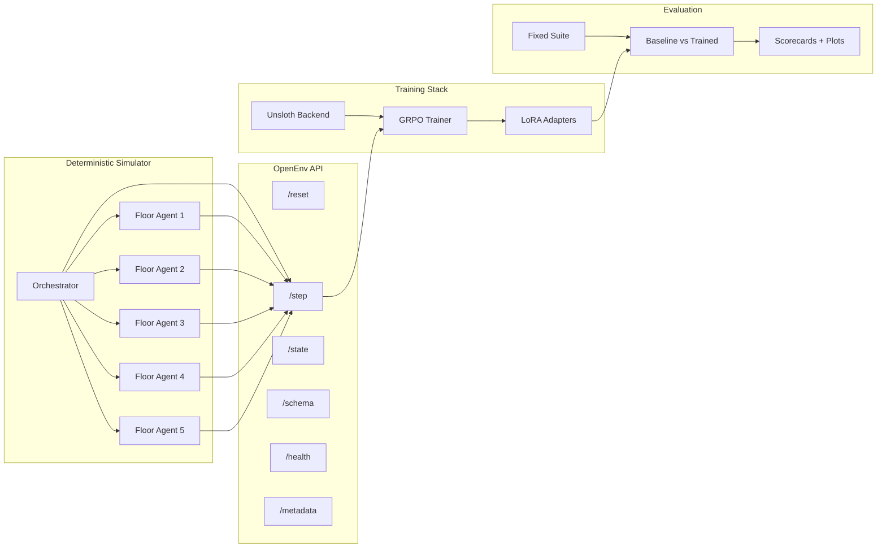

# EvacOS2

**OpenEnv-compatible hierarchical multi-agent evacuation benchmark - deterministic simulator, role-aware GRPO, baseline-to-scorecard evaluation.**

## Judge-Fast Summary

| Aspect | Detail |
|---|---|
| **Domain** | Emergency building evacuation under uncertainty, constrained exits, and evolving hazards |
| **Topology** | `1` orchestrator agent + `5` floor agents |
| **Hierarchy** | `7B` orchestrator for long-horizon coordination, `3B` floor agents for faster local decisions |
| **Interface** | OpenEnv-compatible live endpoints backed by the simulator, with fixed-task and procedural disaster-family resets |
| **Endpoints** | `/openenv/reset`, `/openenv/step`, `/openenv/state`, `/openenv/schema`, `/openenv/health`, `/openenv/metadata` |
| **Training/eval scope** | default fire, flood, and gas specialist response lanes |
| **Training** | Unsloth + LoRA + GRPO-style training, with shared-model and split-role support |
| **Specialization path** | Optional `fire`, `flood`, and `gas` specialist configs with a deterministic scope router driven by observed incident metadata |
| **Evaluation** | Fixed-suite verification, baseline-vs-trained comparison, scorecards, and plots |
| **Validated stronger configs** | `7B` single-model smoke, `7B + vLLM` smoke, `7B/3B` split-role smoke |
| **Metrics support** | Aggregate diagnostics, per-role diagnostics, and checkpoint-local metrics snapshots for cleaner plots |

**Bottom line:** real simulator, real training loop, real evaluation pipeline. This is not a prompt wrapper or a config-only stub.

## Validated Evidence

| Component | Configuration | Status | Evidence |
|---|---|---|---|
| Environment + OpenEnv shell | Deterministic evacuation simulator with `1+5` agent topology | Validated | [openenv.yaml](openenv.yaml), [evacos_ma/](evacos_ma) |
| Shared-model training | `Qwen/Qwen2.5-3B-Instruct` | Checked in | [training/config.yaml](training/config.yaml) |
| Stronger single-model lane | `Qwen/Qwen2.5-7B-Instruct` | Smoke validated on larger GPUs | [training/](training) |
| vLLM lane | `7B + vLLM` | Smoke validated on larger GPUs | [training/](training) |
| Split-role lane | `7B` orchestrator / `3B` floor agents | Smoke validated on larger GPUs | [training/config.remote-unsloth-7b3b-split-bridge.yaml](training/config.remote-unsloth-7b3b-split-bridge.yaml) |
| Split-role disaster specialist lanes | `7B/3B` configs scoped to `fire`, `flood`, or `gas` | Implemented / ready to run | [training/config.remote-unsloth-7b3b-fire-specialist.yaml](training/config.remote-unsloth-7b3b-fire-specialist.yaml), [training/config.remote-unsloth-7b3b-flood-specialist.yaml](training/config.remote-unsloth-7b3b-flood-specialist.yaml), [training/config.remote-unsloth-7b3b-gas-specialist.yaml](training/config.remote-unsloth-7b3b-gas-specialist.yaml) |
| Floor-only 3B specialist lanes | Deterministic stub orchestrator + trainable `3B` floor policy for `fire`, `flood`, or `gas` | Implemented / canary and quality-run configs ready | [training/config.remote-unsloth-3b-fire-floor-specialist-signal-canary-10.yaml](training/config.remote-unsloth-3b-fire-floor-specialist-signal-canary-10.yaml), [training/config.remote-unsloth-3b-fire-floor-specialist-canary-50.yaml](training/config.remote-unsloth-3b-fire-floor-specialist-canary-50.yaml), [training/config.remote-unsloth-3b-fire-floor-specialist-quality-400.yaml](training/config.remote-unsloth-3b-fire-floor-specialist-quality-400.yaml), [training/config.remote-unsloth-3b-flood-floor-specialist-quality-500.yaml](training/config.remote-unsloth-3b-flood-floor-specialist-quality-500.yaml), [training/config.remote-unsloth-3b-gas-floor-specialist-quality-700.yaml](training/config.remote-unsloth-3b-gas-floor-specialist-quality-700.yaml) |
| Specialist routing | Deterministic single-disaster router with generalist fallback for mixed/cascade scenarios | Implemented | [training/scope_router.py](training/scope_router.py) |
| H200 / HF Jobs quality specialist runs | Focused fire/flood/gas floor-specialist configs sized by observed runtime: `400/500/700` steps | Active quality-run lane; completion claims land only after checkpoints and eval artifacts are captured | [training/config.remote-unsloth-3b-fire-floor-specialist-quality-400.yaml](training/config.remote-unsloth-3b-fire-floor-specialist-quality-400.yaml), [training/config.remote-unsloth-3b-flood-floor-specialist-quality-500.yaml](training/config.remote-unsloth-3b-flood-floor-specialist-quality-500.yaml), [training/config.remote-unsloth-3b-gas-floor-specialist-quality-700.yaml](training/config.remote-unsloth-3b-gas-floor-specialist-quality-700.yaml) |
| Split-role metrics | Aggregate + per-role CSV diagnostics, with `metrics_window.csv`, `metrics_to_date.csv`, and `metrics_summary.json` saved beside each checkpoint | Verified | [training/metrics.py](training/metrics.py), [training/train.py](training/train.py) |
| Checkpoint + resume | LoRA adapters, optimizer state, RNG state | Implemented | [training/checkpoint.py](training/checkpoint.py) |
| Evaluation bundle | Fixed suite, comparison, scorecards, plots | Implemented | [evaluation/demo_bundle.py](evaluation/demo_bundle.py), [evaluation/plots.py](evaluation/plots.py) |

Here, **smoke validated** means a capped end-to-end run completed model load, rollout, training, and checkpointing on larger GPUs.

## Why It Matters

Most multi-agent demos stop at showing that agents can talk to each other. The more demanding question is whether post-training measurably improves coordination. Evacuation under uncertainty is a concrete testbed for that question: hazards evolve, exits bottleneck, and no single agent sees the full building.

EvacOS2 is built around three contributions:

1. **A reproducible benchmark.** Deterministic simulator and fixed evaluation suites make runs comparable instead of anecdotal.
2. **Role-aware training.** Shared-model and split-role paths are both supported, including a validated `7B` orchestrator / `3B` floor-agent lane with per-role diagnostics so you can see which role improved and which did not.
3. **Verifiable evaluation.** Baseline-vs-trained comparison, scorecards, and plots come from real rollouts and checkpoints, not hand-curated examples.
4. **A practical specialization path.** The same environment can train a mixed-disaster generalist or separate `fire`, `flood`, and `gas` specialists, then route scenarios through a deterministic scope layer using the incident type that would realistically come from building alarms, sensors, or dispatch reports.

## Architecture



## Hierarchical Specialist Strategy

EvacOS2 supports two complementary training stories:

- **Generalist bridge:** the existing `7B/3B` split-role config samples `fire`, `flood`, and `gas` episodes in one run. This is the most ambitious setting because the same policy stack must learn cross-disaster behavior.
- **Split-role specialist lanes:** the `7B/3B` fire/flood/gas configs keep the same hierarchy but restrict rollouts to one disaster family. These are useful when we want the orchestrator and floor agents to adapt together inside one disaster mode.
- **Floor-only specialist lanes:** the `3B` fire/flood/gas configs use a deterministic stub orchestrator and train only the floor-agent policy. These are cheaper parallel lanes for quickly learning local fire, flood, and gas evacuation behavior before a later shared orchestrator is trained against the frozen specialists.

[training/scope_router.py](training/scope_router.py) is a deterministic routing helper for placing in front of trained specialist checkpoints: it maps single-family scenarios to the matching specialist lane and falls back to the generalist for unknown, mixed, structural, active-threat, or cascade cases. The fixed-suite evaluator records the selected route for each episode and can pass it to a scope-aware policy factory. That gives the demo a clean story without overclaiming specialist training: fast local floor agents handle immediate routing, the stronger orchestrator handles slower global coordination, and the scope layer decides which disaster-specific policy lane to use once those checkpoints are trained.

This routing is meant to model realistic incident classification, not hidden omniscience. In a real deployment, fire mode can be raised by smoke/heat/fire-alarm signals, flood mode by water or moisture sensors plus facility reports, and gas mode by gas/CO/air-quality detectors or manual dispatch metadata. EvacOS2 represents that already-known incident context as scenario metadata, then uses it to select the matching frozen floor specialist while the `7B` orchestrator focuses on building-level coordination.

The `7B` orchestrator is included as a proof of concept for a practical multi-agent workflow: it does not need to slow down every local floor decision. Fast `3B` specialists handle routine floor-level routing, while the larger coordinator can be reserved for global priorities, cross-floor conflicts, stalled evacuations, sensor disagreement, and outlier scenarios that do not fit a single specialist lane. This creates a natural future path toward self-healing coordination: specialist fallback, anomaly escalation, policy repair suggestions, and human-in-the-loop override review can sit above the fast local responders without replacing them.

## What Smoke Testing Showed

The validated stronger configurations each completed:

- model load and multi-agent initialization across the `1+5` topology
- multi-step rollouts over the live environment
- GRPO training steps with LoRA checkpoint persistence
- aggregate and per-role metrics emission to CSV

The split-role lane (`7B` orchestrator / `3B` floor agents) emits separate `orchestrator_loss` and `floor_agent_loss` diagnostics, confirming that the training stack tracks each role independently rather than only globally.

These smoke runs prove computational fit and end-to-end training integrity. Current submission-quality work is positioned on H200-class HF Jobs runs for stronger fire/flood/gas specialist checkpoints, and held-out trained-vs-baseline claims are added only from selected checkpoints, logs, and eval artifacts.

## Submission Artifacts

The repo now includes lightweight, Git-tracked artifacts for reviewers. Large LoRA adapters and raw logs remain outside Git by design.

| Artifact | Current status | What will land here |
|---|---|---|
| **H200 / HF Jobs specialist quality lane** | Active run lane | Fire/flood/gas quality configs are staged for current quality runs; this README does not claim a completed flood H200 result until a checkpoint, logs, and held-out eval artifact are captured |
| **Fixed-suite baseline evidence** | Tracked | [baseline CSV](demo/results/baseline_fixed_suite.csv), [scorecard](demo/results/submission_scorecard_baseline.md), [plots](demo/results/plots) |
| **`3B` specialist canaries** | Tracked | [canary report](demo/results/specialist_canary50_report.md), [score CSV](demo/results/3b_specialist_canary50_scores.csv), and checkpoint plots covering fire/flood/gas route validity, invalid-action reduction, checkpoints, and runtime |
| **Hugging Face Space / live demo surface** | Deployed | [evacos2-openenv](https://huggingface.co/spaces/shashankN777/evacos2-openenv) exposes the canonical `/openenv/*` API surface |
| **Walkthrough video** | External link slot | Link the final public video in this row and in the submission form; draft flow lives in [demo/storyboard.md](demo/storyboard.md) |
| **Hugging Face blog / write-up** | Drafted | Root write-up lives in [BLOG.md](BLOG.md) and is mirrored into the Hugging Face Space |

## 3B Specialist Training Evidence

The cleanest completed specialist evidence is the `50`-step fire/flood/gas floor-agent canary suite. These are not final convergence claims; they are checkpointed proof that the `3B` local responders receive valid observations, produce valid route actions, preserve target IDs, and receive non-zero GRPO contrast.

| Specialist | Start valid-action score | Trained checkpoint score | Delta | Last-10 invalid rate | Last-10 GRPO reward std |
|---|---:|---:|---:|---:|---:|
| Fire `3B` | `83.65%` | `96.54%` | `+12.89 pp` | `3.46%` | `0.7168` |
| Flood `3B` | `88.46%` | `97.54%` | `+9.08 pp` | `2.46%` | `1.3848` |
| Gas `3B` | `89.62%` | `97.13%` | `+7.51 pp` | `2.87%` | `0.9769` |

`valid-action score = 100 * (1 - invalid_action_rate)`. The start score is step `0`; the trained checkpoint score is the last-10 average ending at checkpoint `ckpt_49`.


## Agent Behavior

Each episode places civilians, hazards, stairwells, elevators, and constrained exits inside a deterministic multi-floor building.

| Element | Detail |
|---|---|
| **Orchestrator observation** | Floor summaries, inter-floor bottlenecks, belief rollups, recent floor actions, directive outcomes, unresolved escalations |
| **Floor-agent observation** | Visible rooms/corridors, local hazards, civilian groups, exits on floor, stairwell entries, active directives, action mask |
| **Floor-agent actions** | `route_within_floor`, `prioritize_room`, `open_exit`, `lockdown_room`, `scout`, `predict_state`, `handoff_to_orchestrator`, `wait` |
| **Orchestrator actions** | `route_between_floors`, `call_elevator`, `evacuate_floor_priority`, `broadcast_directive`, `override_floor_agent`, `request_explanation`, `wait` |
| **Reward signal** | Base simulation reward plus team progress, floor saved/lost terms, invalid-action penalties, coordination/directive quality, rationale bonuses |
| **Success shape** | Move civilians to safety while minimizing loss, bottlenecks, and invalid behavior across repeated rounds |

The runtime schema is exposed through `/openenv/schema`, and the canonical types live in [evacos_ma/schemas/multi_agent.py](evacos_ma/schemas/multi_agent.py) and [evacos_ma/schemas/rewards.py](evacos_ma/schemas/rewards.py).

## Fastest Proof Path

```bash
# 1. Generate a baseline evidence bundle. No GPU or checkpoint required.
#    Produces: baseline_vs_trained.csv, submission_scorecard.md, plots/
python -m evaluation.demo_bundle --skip-trained --output-dir outputs/demo_bundle_baseline

# 2. Inspect the OpenEnv contract and live environment package.
cat openenv.yaml
ls evacos_ma/openenv

# 3. Confirm the split-role bridge config is checked in.
cat training/config.remote-unsloth-7b3b-split-bridge.yaml
```

The tracked proof artifacts are available without regenerating:

```bash
cat demo/results/submission_scorecard_baseline.md
```

For a full trained comparison, download or restore the selected LoRA adapter artifact first, then pass that adapter path explicitly:

```bash
CHECKPOINT_DIR=/path/to/downloaded/lora_adapter
python -m evaluation.demo_bundle \
  --trained-checkpoint "$CHECKPOINT_DIR" \
  --config training/config.remote-unsloth-7b3b-split-bridge.yaml \
  --output-dir outputs/demo_bundle
```

To publish the selected adapter artifact to Hugging Face Hub:

```bash
python scripts/upload_adapter.py \
  outputs/training/checkpoints/latest/lora_adapter \
  "$HF_ADAPTER_REPO"
```

Start with [SUBMISSION_BRIEF.md](SUBMISSION_BRIEF.md) if you want the narrative overview first.

## Repository Map

| Path | Purpose |
|---|---|
| [evacos_ma/](evacos_ma) | Simulator, schemas, reward interfaces, OpenEnv server code |
| [training/](training) | Rollout collection, policy adapters, GRPO trainer, checkpoints, backend integration |
| [evaluation/](evaluation) | Fixed-suite verification, comparison helpers, scorecards, plots, demo bundle |
| [dashboard/](dashboard) | Local inspection and demo UI |
| [demo/](demo) | Presentation and story assets |
| [notebooks/train_evacos_ma.ipynb](notebooks/train_evacos_ma.ipynb) | End-to-end notebook flow |

## Training Configs

The checked-in shared-model default is [training/config.yaml](training/config.yaml) with `Qwen/Qwen2.5-3B-Instruct`.

The strongest checked-in split bridge is [training/config.remote-unsloth-7b3b-split-bridge.yaml](training/config.remote-unsloth-7b3b-split-bridge.yaml):

- orchestrator: `Qwen/Qwen2.5-7B-Instruct`
- floor agents: `Qwen/Qwen2.5-3B-Instruct`
- disaster mix: `fire`, `flood`, `gas`

Split-role specialist variants keep the `7B/3B` topology but use one disaster family per run:

- fire: [training/config.remote-unsloth-7b3b-fire-specialist.yaml](training/config.remote-unsloth-7b3b-fire-specialist.yaml)
- flood: [training/config.remote-unsloth-7b3b-flood-specialist.yaml](training/config.remote-unsloth-7b3b-flood-specialist.yaml)
- gas: [training/config.remote-unsloth-7b3b-gas-specialist.yaml](training/config.remote-unsloth-7b3b-gas-specialist.yaml)

Floor-only `3B` specialist variants use a deterministic stub orchestrator and train only the floor-agent adapter:

- fire signal canary: [training/config.remote-unsloth-3b-fire-floor-specialist-signal-canary-10.yaml](training/config.remote-unsloth-3b-fire-floor-specialist-signal-canary-10.yaml)
- fire canary: [training/config.remote-unsloth-3b-fire-floor-specialist-canary-50.yaml](training/config.remote-unsloth-3b-fire-floor-specialist-canary-50.yaml)
- fire throughput smoke: [training/config.remote-unsloth-3b-fire-floor-specialist-throughput-smoke-100.yaml](training/config.remote-unsloth-3b-fire-floor-specialist-throughput-smoke-100.yaml)
- flood throughput smoke: [training/config.remote-unsloth-3b-flood-floor-specialist-throughput-smoke-100.yaml](training/config.remote-unsloth-3b-flood-floor-specialist-throughput-smoke-100.yaml)
- gas throughput smoke: [training/config.remote-unsloth-3b-gas-floor-specialist-throughput-smoke-100.yaml](training/config.remote-unsloth-3b-gas-floor-specialist-throughput-smoke-100.yaml)
- quality runs: [training/config.remote-unsloth-3b-fire-floor-specialist-quality-400.yaml](training/config.remote-unsloth-3b-fire-floor-specialist-quality-400.yaml), [training/config.remote-unsloth-3b-flood-floor-specialist-quality-500.yaml](training/config.remote-unsloth-3b-flood-floor-specialist-quality-500.yaml), [training/config.remote-unsloth-3b-gas-floor-specialist-quality-700.yaml](training/config.remote-unsloth-3b-gas-floor-specialist-quality-700.yaml)
The deeper experimental configs are intentionally not part of the judge-facing path; the active story is the focused specialist quality lane plus routed orchestration.

The specialist canaries are intentionally short proof runs. Use the `10`-step signal canary to prove same-prompt GRPO plumbing, then the `50`-step canary to prove parser/checkpoint/CSV health. The successful fire/flood/gas canary summary is tracked in [demo/results/specialist_canary50_report.md](demo/results/specialist_canary50_report.md).

Modern GRPO/OpenEnv practice requires candidate contrast inside each prompt group. Before any further paid specialist run, verify that the rollout path samples multiple completions for the same role/agent/prompt, groups them under the same prompt-scoped `group_id`, and logs non-zero `floor_agent_group_raw_reward_std_mean` plus non-zero `floor_agent_advantage_std`. A long run with flat groups is expected to waste compute even if mean normalized reward looks positive.

Use [scripts/check_grpo_contrast.py](scripts/check_grpo_contrast.py) as the quick pre-rental/post-run guard for those CSV columns:

```bash
python scripts/check_grpo_contrast.py outputs/path/to/metrics.csv
```

Longer specialist runs should use the focused quality configs on H200-class HF Jobs after a throughput-tuned `100`-step smoke. The canaries proved the reward/grouping signal is healthy; the next risk is wall-clock cost, especially for gas. Do not treat a quality lane as proven until its checkpoint, logs, and held-out eval artifact are captured.

For the active submission path, use the quality configs:

- fire: [training/config.remote-unsloth-3b-fire-floor-specialist-quality-400.yaml](training/config.remote-unsloth-3b-fire-floor-specialist-quality-400.yaml)
- flood: [training/config.remote-unsloth-3b-flood-floor-specialist-quality-500.yaml](training/config.remote-unsloth-3b-flood-floor-specialist-quality-500.yaml)
- gas: [training/config.remote-unsloth-3b-gas-floor-specialist-quality-700.yaml](training/config.remote-unsloth-3b-gas-floor-specialist-quality-700.yaml)

These are the default judge-facing specialist runs. They keep the public scope focused on the capability we can explain and verify: reliable fire, flood, and gas response behavior with checkpointed metrics.

After each real specialist run, convert the saved JSONL traces into a judge-facing eval artifact: one CSV and one plot showing `0-100%` held-out eval score at each 50-step eval checkpoint. Training rewards stay normalized/noisy for GRPO; the public result should show the cleaner eval score curve plus saved/lost civilian outcomes.

Phase-2 orchestrator training supports two frozen-floor modes:

- Single frozen floor policy: set `roles.trainable: ["orchestrator"]` and point `roles.frozen_adapter_paths.floor_agent` at one trained floor adapter.
- Routed frozen specialists: set `roles.frozen_floor_specialist_adapter_paths.fire/flood/gas` so the floor policy deterministically switches among trained `3B` specialists by observed disaster family while the `7B` orchestrator trains.

Start from [training/config.remote-unsloth-7b-orchestrator-frozen-specialists.example.yaml](training/config.remote-unsloth-7b-orchestrator-frozen-specialists.example.yaml) for the routed-specialist run. Checkpoints copy both trainable role adapters and frozen specialist adapter paths into the checkpoint metadata so final eval/upload does not depend on the original remote artifact folders.

Validated stronger lanes include:

- `7B` single-model
- `7B + vLLM`
- `7B/3B` split-role

## Evaluation And Evidence

Key files:

- fixed-suite evaluation: [evaluation/fixed_suite.py](evaluation/fixed_suite.py)
- baseline-vs-trained comparison: [evaluation/baseline_vs_trained.py](evaluation/baseline_vs_trained.py)
- bundle builder: [evaluation/demo_bundle.py](evaluation/demo_bundle.py)
- plot generation: [evaluation/plots.py](evaluation/plots.py)
- tracked proof bundle: [demo/results/](demo/results)

The bundle path emits:

- `baseline_vs_trained.csv`
- `demo_bundle_summary.md`
- `submission_scorecard.md`
- `submission_scorecard.json`
- plots generated from the run's actual metrics CSV

The scorecard includes a `0-100` headline eval score:

```text
eval_score_pct = 100 * save_rate * (1 - 0.5 * invalid_action_rate)
```

This is intentionally separate from training reward. It gives judges a clean success percentage while preserving raw and normalized rewards for debugging GRPO behavior.

Dedicated eval entrypoints wrap the same bundle builder with safer defaults:

```bash
# 3B floor specialists: one disaster family per report.
python scripts/eval_3b_fire.py --trained-checkpoint /path/to/fire/checkpoint-or-lora_adapter
python scripts/eval_3b_flood.py --trained-checkpoint /path/to/flood/checkpoint-or-lora_adapter
python scripts/eval_3b_gas.py --trained-checkpoint /path/to/gas/checkpoint-or-lora_adapter

# Shared 7B orchestrator over routed frozen fire/flood/gas floor specialists.
python scripts/eval_7b_orchestrator.py --trained-checkpoint /path/to/orchestrator/checkpoint-or-lora_adapter
```

By default these scripts evaluate the standard response lane on held-out seeds `42,123,456,789,1024`. The `3B` scripts restrict `disaster_families` to their specialist lane, while the `7B` script evaluates the routed `fire,flood,gas` orchestration stack.

---

Full narrative overview: [SUBMISSION_BRIEF.md](SUBMISSION_BRIEF.md)

Environment secrets: copy [.env.example](.env.example) to `.env` and fill only the local values you need. The real `.env` is gitignored.
