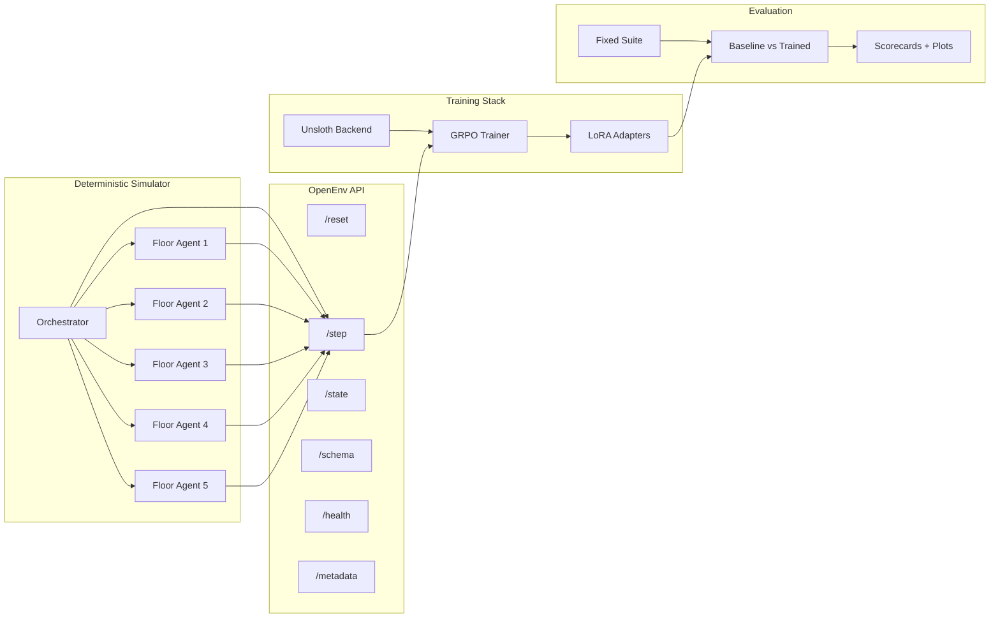

# EvacOS2

**OpenEnv-compatible hierarchical multi-agent evacuation benchmark - deterministic simulator, role-aware GRPO, baseline-to-scorecard evaluation.**

## Judge-Fast Summary

| Aspect | Detail |
|---|---|
| **Domain** | Emergency building evacuation under uncertainty, constrained exits, and evolving hazards |
| **Topology** | `1` orchestrator agent + `5` floor agents |
| **Hierarchy** | `7B` orchestrator for long-horizon coordination, `3B` floor agents for faster local decisions |
| **Interface** | OpenEnv-compatible live endpoints backed by the simulator |
| **Endpoints** | `/openenv/reset`, `/openenv/step`, `/openenv/state`, `/openenv/schema`, `/openenv/health`, `/openenv/metadata` |
| **Difficulty tiers** | `easy`, `medium`, `hard`, `brutal` |
| **Training** | Unsloth + LoRA + GRPO-style training, with shared-model and split-role support |
| **Specialization path** | Optional `fire`, `flood`, and `gas` specialist configs with a deterministic scope router driven by observed incident metadata |
| **Evaluation** | Fixed-suite verification, baseline-vs-trained comparison, scorecards, and plots |
| **Validated stronger configs** | `7B` single-model smoke, `7B + vLLM` smoke, `7B/3B` split-role smoke |
| **Metrics support** | Aggregate diagnostics plus per-role diagnostics such as `orchestrator_loss` and `floor_agent_loss` |

**Bottom line:** real simulator, real training loop, real evaluation pipeline. This is not a prompt wrapper or a config-only stub.

## Validated Evidence

| Component | Configuration | Status | Evidence |
|---|---|---|---|
| Environment + OpenEnv shell | Deterministic evacuation simulator with `1+5` agent topology | Validated | [openenv.yaml](openenv.yaml), [evacos_ma/](evacos_ma) |
| Shared-model training | `Qwen/Qwen2.5-3B-Instruct` | Checked in | [training/config.yaml](training/config.yaml) |
| Stronger single-model lane | `Qwen/Qwen2.5-7B-Instruct` | Smoke validated on stronger hardware | [training/](training) |
| vLLM lane | `7B + vLLM` | Smoke validated on stronger hardware | [training/](training) |
| Split-role lane | `7B` orchestrator / `3B` floor agents | Smoke validated on stronger hardware | [training/config.remote-unsloth-7b3b-split-bridge.yaml](training/config.remote-unsloth-7b3b-split-bridge.yaml) |
| Split-role disaster specialist lanes | `7B/3B` configs scoped to `fire`, `flood`, or `gas` | Implemented / ready to run | [training/config.remote-unsloth-7b3b-fire-specialist.yaml](training/config.remote-unsloth-7b3b-fire-specialist.yaml), [training/config.remote-unsloth-7b3b-flood-specialist.yaml](training/config.remote-unsloth-7b3b-flood-specialist.yaml), [training/config.remote-unsloth-7b3b-gas-specialist.yaml](training/config.remote-unsloth-7b3b-gas-specialist.yaml) |
| Floor-only 3B specialist lanes | Deterministic stub orchestrator + trainable `3B` floor policy for `fire`, `flood`, or `gas` | Implemented / no-download preflight validated | [training/config.remote-unsloth-3b-fire-floor-specialist.yaml](training/config.remote-unsloth-3b-fire-floor-specialist.yaml), [training/config.remote-unsloth-3b-flood-floor-specialist.yaml](training/config.remote-unsloth-3b-flood-floor-specialist.yaml), [training/config.remote-unsloth-3b-gas-floor-specialist.yaml](training/config.remote-unsloth-3b-gas-floor-specialist.yaml) |
| Specialist routing | Deterministic single-disaster router with generalist fallback for mixed/cascade scenarios | Implemented | [training/scope_router.py](training/scope_router.py) |
| Split-role metrics | Aggregate + per-role CSV diagnostics | Verified | [training/metrics.py](training/metrics.py), [training/train.py](training/train.py) |
| Checkpoint + resume | LoRA adapters, optimizer state, RNG state | Implemented | [training/checkpoint.py](training/checkpoint.py) |
| Evaluation bundle | Fixed suite, comparison, scorecards, plots | Implemented | [evaluation/demo_bundle.py](evaluation/demo_bundle.py), [evaluation/plots.py](evaluation/plots.py) |
| A100 split-role run | `7B` orchestrator / `3B` floor agents, 100 steps, final `ckpt_99` | Tracked summary | [demo/results/a100_7b3b_run_summary.md](demo/results/a100_7b3b_run_summary.md), [demo/results/plots/a100_7b3b_training_signal.png](demo/results/plots/a100_7b3b_training_signal.png) |

Here, **smoke validated** means a capped end-to-end run completed model load, rollout, training, and checkpointing on stronger hardware.

## Why It Matters

Most multi-agent demos stop at showing that agents can talk to each other. The harder question is whether post-training measurably improves coordination. Evacuation under uncertainty is a concrete testbed for that question: hazards evolve, exits bottleneck, and no single agent sees the full building.

EvacOS2 is built around three contributions:

1. **A reproducible benchmark.** Deterministic simulator, four difficulty tiers, and fixed evaluation suites make runs comparable instead of anecdotal.
2. **Role-aware training.** Shared-model and split-role paths are both supported, including a validated `7B` orchestrator / `3B` floor-agent lane with per-role diagnostics so you can see which role improved and which did not.
3. **Verifiable evaluation.** Baseline-vs-trained comparison, scorecards, and plots come from real rollouts and checkpoints, not hand-curated examples.
4. **A practical specialization path.** The same environment can train a mixed-disaster generalist or separate `fire`, `flood`, and `gas` specialists, then route scenarios through a deterministic scope layer using the incident type that would realistically come from building alarms, sensors, or dispatch reports.

## Architecture



## Hierarchical Specialist Strategy

EvacOS2 supports two complementary training stories:

- **Generalist bridge:** the existing `7B/3B` split-role config samples `fire`, `flood`, and `gas` episodes in one run. This is the most ambitious setting because the same policy stack must learn cross-disaster behavior.
- **Split-role specialist lanes:** the `7B/3B` fire/flood/gas configs keep the same hierarchy but restrict rollouts to one disaster family. These are useful when we want the orchestrator and floor agents to adapt together inside one disaster mode.
- **Floor-only specialist lanes:** the `3B` fire/flood/gas configs use a deterministic stub orchestrator and train only the floor-agent policy. These are cheaper parallel lanes for quickly learning local fire, flood, and gas evacuation behavior before a later shared orchestrator is trained against the frozen specialists.

[training/scope_router.py](training/scope_router.py) is a deterministic routing helper for placing in front of trained specialist checkpoints: it maps single-family scenarios to the matching specialist lane and falls back to the generalist for unknown, mixed, structural, active-threat, or cascade cases. The fixed-suite evaluator records the selected route for each episode and can pass it to a scope-aware policy factory. That gives the demo a clean story without overclaiming specialist training: fast local floor agents handle immediate routing, the stronger orchestrator handles slower global coordination, and the scope layer decides which disaster-specific policy lane to use once those checkpoints are trained.

This routing is meant to model realistic incident classification, not hidden omniscience. In a real deployment, fire mode can be raised by smoke/heat/fire-alarm signals, flood mode by water or moisture sensors plus facility reports, and gas mode by gas/CO/air-quality detectors or manual dispatch metadata. EvacOS2 represents that already-known incident context as scenario metadata, then uses it to select the matching frozen floor specialist while the `7B` orchestrator focuses on building-level coordination.

## What Smoke Testing Showed

The validated stronger configurations each completed:

- model load and multi-agent initialization across the `1+5` topology
- multi-step rollouts over the live environment
- GRPO training steps with LoRA checkpoint persistence
- aggregate and per-role metrics emission to CSV

The split-role lane (`7B` orchestrator / `3B` floor agents) emits separate `orchestrator_loss` and `floor_agent_loss` diagnostics, confirming that the training stack tracks each role independently rather than only globally.

These smoke runs prove computational fit and end-to-end training integrity. The tracked A100 run summary shows the first serious split-role training signal; full held-out trained-vs-baseline claims should still be generated from the selected LoRA checkpoint before the final pitch.

## Submission Artifacts

The repo now includes lightweight, Git-tracked artifacts for reviewers. Large LoRA adapters and raw logs remain outside Git by design.

| Artifact | Current status | What will land here |
|---|---|---|
| **A100 training signal** | Tracked | [run summary](demo/results/a100_7b3b_run_summary.md), [training-signal CSV](demo/results/a100_7b3b_training_signal.csv), [reward plot](demo/results/plots/a100_7b3b_training_signal.png) |
| **Fixed-suite baseline evidence** | Tracked | [baseline CSV](demo/results/baseline_fixed_suite.csv), [scorecard](demo/results/submission_scorecard_baseline.md), [plots](demo/results/plots) |
| **Hugging Face Space / live demo surface** | Deployed | [evacos2-openenv](https://huggingface.co/spaces/shashankN777/evacos2-openenv) exposes the canonical `/openenv/*` API surface |
| **YouTube walkthrough video** | Placeholder | Add final video URL here after recording; draft flow lives in [demo/storyboard.md](demo/storyboard.md) |
| **Hugging Face blog / write-up** | Drafted | Local draft lives in [demo/hf_blog.md](demo/hf_blog.md); replace with the published HF post URL before final submission |

## Agent Behavior

Each episode places civilians, hazards, stairwells, elevators, and constrained exits inside a deterministic multi-floor building.

| Element | Detail |
|---|---|
| **Orchestrator observation** | Floor summaries, inter-floor bottlenecks, belief rollups, recent floor actions, directive outcomes, unresolved escalations |
| **Floor-agent observation** | Visible rooms/corridors, local hazards, civilian groups, exits on floor, stairwell entries, active directives, action mask |
| **Floor-agent actions** | `route_within_floor`, `prioritize_room`, `open_exit`, `lockdown_room`, `scout`, `predict_state`, `handoff_to_orchestrator`, `wait` |
| **Orchestrator actions** | `route_between_floors`, `call_elevator`, `evacuate_floor_priority`, `broadcast_directive`, `override_floor_agent`, `request_explanation`, `wait` |
| **Reward signal** | Base simulation reward plus team progress, floor saved/lost terms, invalid-action penalties, coordination/directive quality, rationale bonuses |
| **Success shape** | Move civilians to safety while minimizing loss, bottlenecks, and invalid behavior across repeated rounds |

The runtime schema is exposed through `/openenv/schema`, and the canonical types live in [evacos_ma/schemas/multi_agent.py](evacos_ma/schemas/multi_agent.py) and [evacos_ma/schemas/rewards.py](evacos_ma/schemas/rewards.py).

## Fastest Proof Path

```bash
# 1. Generate a baseline evidence bundle. No GPU or checkpoint required.
#    Produces: baseline_vs_trained.csv, submission_scorecard.md, plots/
python -m evaluation.demo_bundle --skip-trained --output-dir outputs/demo_bundle_baseline

# 2. Inspect the OpenEnv contract and live environment package.
cat openenv.yaml
ls evacos_ma/openenv

# 3. Confirm the split-role bridge config is checked in.
cat training/config.remote-unsloth-7b3b-split-bridge.yaml
```

The tracked proof artifacts are available without regenerating:

```bash
cat demo/results/a100_7b3b_run_summary.md
cat demo/results/submission_scorecard_baseline.md
```

For a full trained comparison, download or restore the selected LoRA adapter artifact first, then pass that adapter path explicitly:

```bash
CHECKPOINT_DIR=/path/to/downloaded/lora_adapter
python -m evaluation.demo_bundle \
  --trained-checkpoint "$CHECKPOINT_DIR" \
  --config training/config.remote-unsloth-7b3b-split-bridge.yaml \
  --output-dir outputs/demo_bundle
```

To publish the selected adapter artifact to Hugging Face Hub:

```bash
python scripts/upload_adapter.py \
  outputs/training/checkpoints/latest/lora_adapter \
  "$HF_ADAPTER_REPO"
```

Start with [SUBMISSION_BRIEF.md](SUBMISSION_BRIEF.md) if you want the narrative overview first.

## Repository Map

| Path | Purpose |
|---|---|
| [evacos_ma/](evacos_ma) | Simulator, schemas, reward interfaces, OpenEnv server code |
| [training/](training) | Rollout collection, policy adapters, GRPO trainer, checkpoints, backend integration |
| [evaluation/](evaluation) | Fixed-suite verification, comparison helpers, scorecards, plots, demo bundle |
| [dashboard/](dashboard) | Local inspection and demo UI |
| [demo/](demo) | Presentation and story assets |
| [notebooks/train_evacos_ma.ipynb](notebooks/train_evacos_ma.ipynb) | End-to-end notebook flow |

## Training Configs

The checked-in shared-model default is [training/config.yaml](training/config.yaml) with `Qwen/Qwen2.5-3B-Instruct`.

The strongest checked-in split bridge is [training/config.remote-unsloth-7b3b-split-bridge.yaml](training/config.remote-unsloth-7b3b-split-bridge.yaml):

- orchestrator: `Qwen/Qwen2.5-7B-Instruct`
- floor agents: `Qwen/Qwen2.5-3B-Instruct`
- disaster mix: `fire`, `flood`, `gas`

Split-role specialist variants keep the `7B/3B` topology but use one disaster family per run:

- fire: [training/config.remote-unsloth-7b3b-fire-specialist.yaml](training/config.remote-unsloth-7b3b-fire-specialist.yaml)
- flood: [training/config.remote-unsloth-7b3b-flood-specialist.yaml](training/config.remote-unsloth-7b3b-flood-specialist.yaml)
- gas: [training/config.remote-unsloth-7b3b-gas-specialist.yaml](training/config.remote-unsloth-7b3b-gas-specialist.yaml)

Floor-only `3B` specialist variants use a deterministic stub orchestrator and train only the floor-agent adapter:

- fire: [training/config.remote-unsloth-3b-fire-floor-specialist.yaml](training/config.remote-unsloth-3b-fire-floor-specialist.yaml)
- flood: [training/config.remote-unsloth-3b-flood-floor-specialist.yaml](training/config.remote-unsloth-3b-flood-floor-specialist.yaml)
- gas: [training/config.remote-unsloth-3b-gas-floor-specialist.yaml](training/config.remote-unsloth-3b-gas-floor-specialist.yaml)

Phase-2 orchestrator training supports two frozen-floor modes:

- Single frozen floor policy: set `roles.trainable: ["orchestrator"]` and point `roles.frozen_adapter_paths.floor_agent` at one trained floor adapter.
- Routed frozen specialists: set `roles.frozen_floor_specialist_adapter_paths.fire/flood/gas` so the floor policy deterministically switches among trained `3B` specialists by observed disaster family while the `7B` orchestrator trains.

Start from [training/config.remote-unsloth-7b-orchestrator-frozen-specialists.example.yaml](training/config.remote-unsloth-7b-orchestrator-frozen-specialists.example.yaml) for the routed-specialist run. Checkpoints copy both trainable role adapters and frozen specialist adapter paths into the checkpoint metadata so final eval/upload does not depend on the original remote artifact folders.

Validated stronger lanes include:

- `7B` single-model
- `7B + vLLM`
- `7B/3B` split-role

## Evaluation And Evidence

Key files:

- fixed-suite evaluation: [evaluation/fixed_suite.py](evaluation/fixed_suite.py)
- baseline-vs-trained comparison: [evaluation/baseline_vs_trained.py](evaluation/baseline_vs_trained.py)
- bundle builder: [evaluation/demo_bundle.py](evaluation/demo_bundle.py)
- plot generation: [evaluation/plots.py](evaluation/plots.py)
- tracked proof bundle: [demo/results/](demo/results)

The bundle path emits:

- `baseline_vs_trained.csv`
- `demo_bundle_summary.md`
- `submission_scorecard.md`
- `submission_scorecard.json`
- plots generated from the run's actual metrics CSV

The scorecard includes a bounded `0-100` headline eval score:

```text
eval_score_pct = 100 * save_rate * (1 - 0.5 * invalid_action_rate)
```

This is intentionally separate from training reward. It gives judges a clean success percentage while preserving raw and normalized rewards for debugging GRPO behavior.

Dedicated eval entrypoints wrap the same bundle builder with safer defaults:

```bash
# 3B floor specialists: one disaster family per report.
python scripts/eval_3b_fire.py --trained-checkpoint /path/to/fire/checkpoint-or-lora_adapter
python scripts/eval_3b_flood.py --trained-checkpoint /path/to/flood/checkpoint-or-lora_adapter
python scripts/eval_3b_gas.py --trained-checkpoint /path/to/gas/checkpoint-or-lora_adapter

# Shared 7B orchestrator over routed frozen fire/flood/gas floor specialists.
python scripts/eval_7b_orchestrator.py --trained-checkpoint /path/to/orchestrator/checkpoint-or-lora_adapter
```

By default these scripts evaluate `easy,medium,hard,brutal` on held-out seeds `42,123,456,789,1024`. The `3B` scripts restrict `disaster_families` to their specialist lane, while the `7B` script evaluates the routed `fire,flood,gas` orchestration stack.

---

Full narrative overview: [SUBMISSION_BRIEF.md](SUBMISSION_BRIEF.md)

Environment secrets: copy [.env.example](.env.example) to `.env` and fill only the local values you need. The real `.env` is gitignored.
