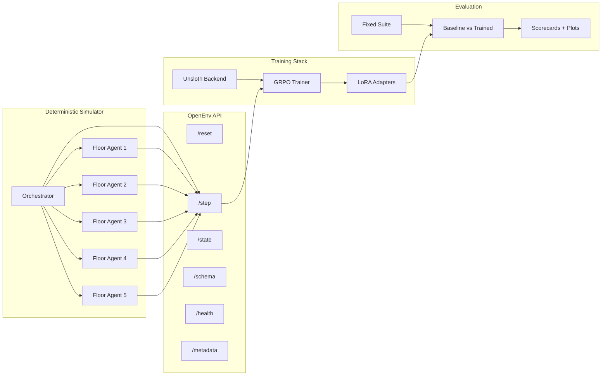

# EvacOS2

**Hierarchical multi-agent evacuation benchmark with a deterministic simulator, GRPO-style post-training, and judge-ready evidence artifacts.**

For the fastest submission overview, start with [SUBMISSION_BRIEF.md](SUBMISSION_BRIEF.md).

## Judge-Fast Summary

| Aspect | Detail |
|---|---|
| **Domain** | Emergency building evacuation under uncertainty, constrained exits, and evolving hazards |
| **Topology** | `1` orchestrator agent + `5` floor agents |
| **Interface** | OpenEnv-compatible live endpoints backed by the simulator |
| **Endpoints** | `/openenv/reset`, `/openenv/step`, `/openenv/state`, `/openenv/schema`, `/openenv/health`, `/openenv/metadata` |
| **Difficulty tiers** | `easy`, `medium`, `hard`, `brutal` |
| **Training** | Unsloth + LoRA + GRPO-style training, with shared-model and split-role support |
| **Evaluation** | Fixed-suite verification, baseline-vs-trained comparison, scorecards, and plots |
| **Validated stronger configs** | `7B` single-model smoke, `7B + vLLM` smoke, `7B/3B` split-role smoke |
| **Metrics support** | Aggregate diagnostics plus per-role diagnostics such as `orchestrator_loss` and `floor_agent_loss` |

**Bottom line:** real simulator, real training loop, real evaluation pipeline. This is not a prompt wrapper or a config-only stub.

## Validated Evidence

| Component | Configuration | Status | Evidence |
|---|---|---|---|
| Environment + OpenEnv shell | Deterministic evacuation simulator with `1+5` agent topology | Validated | [openenv.yaml](openenv.yaml), [evacos_ma/](evacos_ma) |
| Shared-model training | `Qwen/Qwen2.5-3B-Instruct` | Checked in | [training/config.yaml](training/config.yaml) |
| Stronger single-model lane | `Qwen/Qwen2.5-7B-Instruct` | Smoke validated on stronger hardware | [training/](training) |
| vLLM lane | `7B + vLLM` | Smoke validated on stronger hardware | [training/](training) |
| Split-role lane | `7B` orchestrator / `3B` floor agents | Smoke validated on stronger hardware | [training/config.remote-unsloth-7b3b-split-bridge.yaml](training/config.remote-unsloth-7b3b-split-bridge.yaml) |
| Split-role metrics | Aggregate + per-role CSV diagnostics | Verified | [training/metrics.py](training/metrics.py), [training/train.py](training/train.py) |
| Checkpoint + resume | LoRA adapters, optimizer state, RNG state | Implemented | [training/checkpoints.py](training/checkpoints.py) |
| Evaluation bundle | Fixed suite, comparison, scorecards, plots | Implemented | [evaluation/demo_bundle.py](evaluation/demo_bundle.py), [evaluation/plots.py](evaluation/plots.py) |

## Why It Matters

Most OpenEnv-style submissions stop at one layer: a simulator, a training loop, or an evaluation stub. EvacOS2 closes the loop end to end:

1. deterministic multi-agent environment
2. role-aware GRPO-style training
3. checkpointing and resume
4. baseline-vs-trained evaluation
5. judge-consumable scorecards and plots

## Architecture



## Fastest Proof Path

1. Read [SUBMISSION_BRIEF.md](SUBMISSION_BRIEF.md)
2. Inspect the OpenEnv contract in [openenv.yaml](openenv.yaml)
3. Build a baseline evidence bundle:

   ```bash
   python -m evaluation.demo_bundle --skip-trained --output-dir outputs/demo_bundle_baseline
   ```

4. Build a trained comparison bundle once you have a checkpoint:

   ```bash
   python -m evaluation.demo_bundle \
     --trained-checkpoint outputs/training/checkpoints/latest/lora_adapter \
     --output-dir outputs/demo_bundle
   ```

5. Inspect the checked-in split-role bridge config:
   [training/config.remote-unsloth-7b3b-split-bridge.yaml](training/config.remote-unsloth-7b3b-split-bridge.yaml)

## OpenEnv Surface

The public environment contract is described in [openenv.yaml](openenv.yaml).

Key endpoints:

- `/openenv/reset`
- `/openenv/step`
- `/openenv/state`
- `/openenv/schema`
- `/openenv/health`
- `/openenv/metadata`

This is wired to the live simulator in [evacos_ma/](evacos_ma), not a canned response layer.

## Repository Map

| Path | Purpose |
|---|---|
| [evacos_ma/](evacos_ma) | Simulator, schemas, reward interfaces, OpenEnv server code |
| [training/](training) | Rollout collection, policy adapters, GRPO trainer, checkpoints, backend integration |
| [evaluation/](evaluation) | Fixed-suite verification, comparison helpers, scorecards, plots, demo bundle |
| [dashboard/](dashboard) | Local inspection and demo UI |
| [demo/](demo) | Presentation and story assets |
| [notebooks/train_evacos_ma.ipynb](notebooks/train_evacos_ma.ipynb) | End-to-end notebook flow |

## Training Modes

### 1. Shared-model default

Default checked-in path:

- base model: `Qwen/Qwen2.5-3B-Instruct`
- config entrypoint: [training/config.yaml](training/config.yaml)

### 2. Stronger single-model lane

Validated smoke lane:

- `7B` single-model
- `7B + vLLM`

### 3. Split-role lane

Checked-in split bridge config:

- [training/config.remote-unsloth-7b3b-split-bridge.yaml](training/config.remote-unsloth-7b3b-split-bridge.yaml)

Resolved topology:

- orchestrator: `Qwen/Qwen2.5-7B-Instruct`
- floor agents: `Qwen/Qwen2.5-3B-Instruct`

## Evaluation And Evidence

Key files:

- fixed-suite evaluation: [evaluation/fixed_suite.py](evaluation/fixed_suite.py)
- baseline-vs-trained comparison: [evaluation/baseline_vs_trained.py](evaluation/baseline_vs_trained.py)
- bundle builder: [evaluation/demo_bundle.py](evaluation/demo_bundle.py)
- plot generation: [evaluation/plots.py](evaluation/plots.py)

The bundle path emits:

- `baseline_vs_trained.csv`
- `demo_bundle_summary.md`
- `submission_scorecard.md`
- `submission_scorecard.json`
- plots generated from the run's actual metrics CSV

## Secrets

Copy [.env.example](.env.example) to `.env` and fill only the local values you need. The real `.env` is gitignored.
