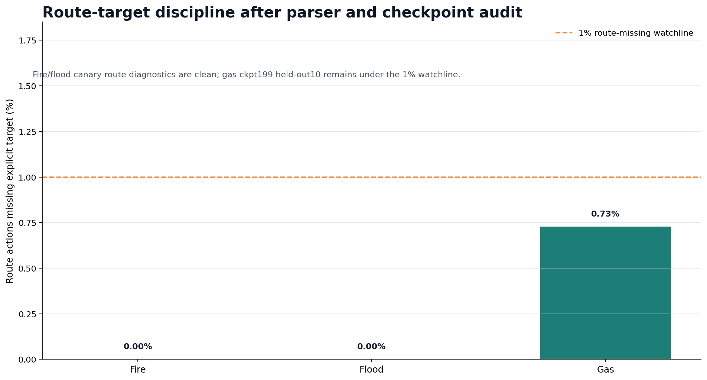

# Evaluating LLM Agent Teams in Real-World-Inspired Scenarios Through Hierarchical Emergency Evacuation

**Author:** Sai Shashank Narang  
**Affiliation:** School of Computer Science and Engineering  
**Institution:** Lovely Professional University  
**Location:** Phagwara, India  
**Email:** saishashanknarang@gmail.com  
**Date:** June 2026  
**Implementation:** EvacOS2  
**Primary repository:** [sai-shashankN/EvacOS2](https://github.com/sai-shashankN/EvacOS2)  
**Online environment:** [shashankN777/evacos2-openenv](https://huggingface.co/spaces/shashankN777/evacos2-openenv)  
**Reproducibility archive:** [shashankN777/evacos2-7b-orchestrator-artifacts](https://huggingface.co/shashankN777/evacos2-7b-orchestrator-artifacts)

## Abstract

Large language model agents are increasingly evaluated as interactive systems, yet many benchmarks still reward isolated task completion rather than team performance in realistic settings. Real deployments often require model allocation: small models should handle fast local execution, while larger models should be reserved for global coordination, escalation, and exception handling. We present EvacOS2, an OpenEnv-compatible benchmark for evaluating this question in a high-stakes real-world-inspired domain: emergency evacuation. EvacOS2 places one building-level orchestrator and five floor-level agents inside a deterministic simulator covering fire, flood, and gas emergencies. The environment exposes a live `/openenv/*` API, procedural resets, structured multi-agent observations, validated action schemas, role-specific rewards, LoRA training, and fixed-suite evaluation artifacts.

The central problem is not merely whether an agent can solve an evacuation. It is whether a team can be evaluated on the right division of labor: when fast local agents should act, when they should escalate, when a larger model should coordinate, and whether the resulting actions remain valid under consequences over time. We report three evidence tiers. First, the live Hugging Face Space validates the OpenEnv contract for fire, flood, and gas response lanes with a `1 + 5` topology. Second, held-out floor-specialist evaluation compares Qwen2.5-3B-Instruct without LoRA against trained LoRA specialists over a controlled 30-episode proof slice: 10 unseen seeds each for fire, flood, and gas. Trained specialists improve bounded evaluation score from `62.38%` to `80.05%` (`+17.67 pp`) and reduce invalid actions from `34.47%` to `1.10%` (`-33.37 pp`). This 30-episode scorecard is the clean headline comparison, not the full interaction footprint. The broader artifact trail includes three `50`-step floor-specialist canaries, three H200 continuations from `ckpt_49` to `ckpt_199`, a refreshed gas route audit, a `100`-step split-role `7B/3B` run, and a later `7B` orchestrator continuation canary. Third, the split-role and continuation evidence show that the higher-capacity coordination layer is wired, checkpointable, and role-observable, while final held-out orchestrator convergence remains future work. These results suggest that EvacOS2 is a practical benchmark for evaluating real-world LLM agent teams, model allocation, and environment-driven post-training.

## Keywords

OpenEnv, agentic evaluation, model allocation, multi-agent reinforcement learning, emergency evacuation, LoRA, GRPO, Qwen2.5, LLM agents, calibrated autonomy, hierarchical coordination

## 1. Introduction

Most modern language model evaluation still begins from a prompt and ends with a text answer. That paradigm is useful for measuring factuality, reasoning, and style, but it under-specifies the problems that deployed agents face: actions have delayed effects, state changes after every decision, different agents see different parts of the world, and correctness is often defined by an external environment rather than by an evaluator reading a transcript.

The next evaluation problem is team performance in real-world scenarios. In practical agent systems, the question is rarely "can one model answer this?" A more realistic question is "which agent should act, which agent should defer, and when should the system spend more compute on a larger model?" Small models may be better for fast local execution because they are cheaper and lower latency. Larger models may be better for global coordination, ambiguity, escalation, and exception handling. A benchmark for agentic systems should therefore measure not only task success, but whether the right model acted at the right time under valid action constraints.

Emergency evacuation is a compact but demanding testbed for this gap. A floor responder may know which rooms and corridors are blocked locally but not whether another floor has already saturated a stairwell. A building-level coordinator may see global bottlenecks but not every room-level hazard detail. Good behavior therefore requires local autonomy and global coordination at the same time. A model that can write a plausible evacuation plan may still fail if it emits malformed actions, routes civilians into bottlenecks, overrides local responders without improving outcomes, or refuses to escalate when local state is insufficient.

EvacOS2 converts this model-allocation problem into an OpenEnv-compatible benchmark. The environment contains a deterministic simulator with civilians, rooms, corridors, exits, stairwells, elevators, hazards, local floor observations, and building-level orchestration. It supports a `1 + 5` agent topology: one orchestrator and five floor agents. The public evaluation lanes cover fire, flood, and gas response. The training stack supports shared-model policies, split-role policies, and floor-specialist policies with LoRA adapters. The evaluation stack produces fixed-suite scorecards, plots, and artifact trails.

The problem statement is:

> How should we evaluate and improve LLM agent teams in realistic scenarios where decisions require state tracking, coordination, model allocation, valid actions, and consequences over time?

This problem is studied through three research questions:

1. **RQ1:** Can environment-based post-training improve the reliability of small local LLM agents under strict action schemas?
2. **RQ2:** Can a hierarchical benchmark expose the division of labor between fast floor-level specialists and a higher-capacity coordinator?
3. **RQ3:** What public artifact trail is needed for a real-world-inspired agent benchmark to be reproducible and honestly interpretable?

EvacOS2 answers these questions through emergency evacuation. Smaller `3B` agents are evaluated as fast local floor responders. A larger `7B` agent is evaluated as the slower global coordinator responsible for priorities, bottlenecks, exceptions, and escalation. The evacuation setting is the concrete domain; the broader benchmark target is real-world agent-team evaluation.

This paper makes a careful claim. EvacOS2 already demonstrates a working OpenEnv surface and a measurable held-out improvement for `3B` floor specialists. It also demonstrates a viable `7B` orchestrator path through smoke, checkpoint, parser, and role-metric canary evidence. It does not yet claim final held-out `7B` orchestrator convergence.

## 2. Contributions

This work makes six contributions:

1. **A real-world-inspired agent-team evaluation problem.** The benchmark asks whether an agent team can act under partial observability, evolving state, strict action contracts, and delayed consequences.
2. **A concrete model-allocation testbed.** EvacOS2 separates fast `3B` floor specialists from a slower `7B` orchestrator, making it possible to evaluate when local execution is enough and when global coordination is needed.
3. **An OpenEnv-compatible public runtime.** The Hugging Face Space exposes `/openenv/health`, `/openenv/metadata`, `/openenv/schema`, `/openenv/reset`, `/openenv/step`, and `/openenv/state`.
4. **Role-aware post-training infrastructure.** The training stack supports shared policies, split `7B/3B` roles, and disaster-specific `3B` floor specialists using LoRA and GRPO-style optimization.
5. **A controlled held-out evaluation slice.** The main quantitative result compares Qwen2.5-3B-Instruct without LoRA against trained LoRA floor specialists over the same unseen seeds and evaluator.
6. **A transparent artifact trail.** The implementation separates baseline-only fixed-suite artifacts, canary training evidence, held-out `3B` specialist comparison, adapter checkpoints, and `7B` orchestrator behavior-card evidence.

## 3. Related Work

### 3.1 Agentic environments and OpenEnv

OpenEnv positions environment construction as a protocol layer for agentic reinforcement learning: agents interact with terminals, browsers, APIs, simulators, and other execution environments rather than static prompt sets [1, 2]. EvacOS2 follows this direction by exposing a reproducible simulator behind an OpenEnv-style API and by preserving a clear boundary between environment state, valid actions, reward, and evaluation artifacts.

### 3.2 Multi-agent reinforcement learning in open environments

Cooperative multi-agent reinforcement learning studies teams of agents that coordinate to achieve shared objectives. Recent surveys emphasize the difficulty of moving from closed, static settings to open environments where state, tasks, and agent capabilities may change over time [3]. EvacOS2 is aligned with this direction: hazards evolve, observations are role-specific, and agents must coordinate under partial observability and shared resource constraints.

### 3.3 Policy-gradient and GRPO-style optimization

Proximal Policy Optimization (PPO) is a widely used policy-gradient family that alternates environment sampling with clipped surrogate-objective optimization [4]. Group Relative Policy Optimization (GRPO), introduced in DeepSeekMath, reduces the resource burden of PPO-style training by estimating a baseline from grouped samples instead of training a separate critic model [5]. EvacOS2 uses GRPO-style grouped reward contrast because the simulator supplies programmatic rewards and because resource constraints make critic-free optimization attractive.

### 3.4 Parameter-efficient fine-tuning and serving

LoRA freezes pretrained model weights and injects low-rank trainable matrices, reducing trainable parameter count and memory requirements for adaptation [6]. This is important for EvacOS2 because the system stores multiple role and disaster adapters without committing full model copies. vLLM and PagedAttention address memory-efficient LLM serving by improving KV-cache management [7], which is relevant for rollout throughput and future larger-scale environment interaction. Qwen2.5 provides the base instruction-tuned models used in the reported training lanes [8].

## 4. Environment Design

### 4.1 Task setting

EvacOS2 simulates emergency evacuation in a multi-floor building. Each episode contains:

- floor-level rooms and corridors
- civilians with mobility profiles
- local hazards and evolving disaster state
- exits, stairwells, elevators, and bottlenecks
- role-specific observations
- schema-constrained actions
- per-role rewards and global termination state

The public OpenEnv manifest defines three procedural response lanes:

| Task ID | Name | Disaster family |
|---|---|---|
| `openenv_fire_response` | Fire Response Evacuation | `fire` |
| `openenv_flood_response` | Flood Response Evacuation | `flood` |
| `openenv_gas_response` | Gas Response Evacuation | `gas` |

The live metadata advertises one orchestrator and five floor agents. Debug state is disabled publicly, so `/openenv/state` exposes metadata without leaking full simulator internals.

### 4.2 Agent roles

The orchestrator observes floor summaries, inter-floor bottlenecks, recent actions, directive outcomes, and escalation state. It can issue global coordination actions such as broadcasting directives, prioritizing floors, requesting explanations, or overriding a local plan.

Floor agents observe local rooms, corridors, hazards, exits, active directives, local civilians, and action masks. They can scout, route within a floor, prioritize rooms, open exits, hand off to the orchestrator, or wait.

This division is deliberate. The `3B` floor specialists provide fast local response. The `7B` orchestrator is reserved for slower building-level judgment: cross-floor conflicts, bottleneck management, outlier cases, and fallback when specialist routing is inappropriate. In evaluation terms, this turns model selection itself into a measurable behavior. A good system should not route every decision to the largest model, and it should not force small local models to handle global exceptions alone.

### 4.3 Calibrated autonomy

The deeper benchmark target is not merely evacuation. EvacOS2 tests calibrated autonomy: whether an agent knows when it should solve a problem locally and when the team is safer if the problem is escalated. In a hierarchical agent system, local competence can be harmful if it prevents global coordination. Conversely, excessive deference can waste time in emergencies. EvacOS2 forces that tradeoff into a measurable environment.

### 4.4 Model allocation as an evaluation target

EvacOS2 treats model allocation as part of agent performance. The intended allocation is:

| System role | Model size | Intended use | Evaluation question |
|---|---:|---|---|
| Floor specialist | `3B` | Fast local routing, routine disaster-family response, action-contract reliability | Can a smaller model execute valid local actions quickly and consistently? |
| Orchestrator | `7B` | Global priorities, bottlenecks, overrides, escalation, mixed or unusual cases | Does a larger model improve team coordination when local views are insufficient? |
| Scope router | deterministic | Select single-family specialist or fallback path from incident metadata | Does the system avoid wasting large-model compute on routine scoped cases? |

This framing matters beyond evacuation. Real agent systems will need to decide when to use smaller models, when to call larger ones, and how to measure whether that allocation improved outcomes. EvacOS2 provides a grounded environment where those decisions can be measured through valid actions, rewards, saved civilians, escalation behavior, and role-specific diagnostics.

## 5. Training System

### 5.1 Model stack

The implementation uses Qwen2.5 instruction-tuned models:

- `Qwen/Qwen2.5-3B-Instruct` for floor-specialist lanes.
- `Qwen/Qwen2.5-7B-Instruct` for the orchestrator path.
- Split-role configurations where the orchestrator and floor agents can use different base models and LoRA adapters.

The implementation supports:

- shared-model training
- split `7B/3B` training
- disaster-specific `7B/3B` configs
- floor-only `3B` fire, flood, and gas specialists
- deterministic scope routing for selecting a specialist lane

### 5.2 LoRA and checkpointing

Adapters are stored separately from base model weights. Each checkpoint may include LoRA adapter files, optimizer state, RNG state, metrics, and logs. Large adapter artifacts are hosted outside Git in the public Hugging Face artifact repository.

The reproducibility archive currently includes floor-specialist fire, flood, and gas adapters and a `7B` orchestrator continuation canary path:

- `floor-specialists/fire/h200-resume200-ckpt199/checkpoints/ckpt_199`
- `floor-specialists/flood/h200-resume200-ckpt199/checkpoints/ckpt_199`
- `floor-specialists/gas/h200-resume200-ckpt199/checkpoints/ckpt_199`
- `runs/vast-unsloth-7b-orchestrator-frozen-specialists-continue360-1c40744-48gb`

The same archive stores both floor-specialist checkpoints and the later `7B` continuation run so related experiment artifacts can be inspected from one location.

### 5.3 Reward design

EvacOS2 does not rely on a single opaque reward. The training and evaluation code track signals such as:

- saved civilians and casualties
- movement progress
- invalid-action penalties
- route validity and target preservation
- local floor-routing quality
- orchestrator directive quality
- override usefulness
- explanation and prediction-related diagnostics

Training rewards can be normalized and contrastive for GRPO-style optimization. Evaluation reports bounded metrics such as evaluation score, invalid-action rate, save-rate components, and base-vs-trained deltas.

## 6. Evaluation Methodology

### 6.1 Evidence tiers

EvacOS2 separates four evidence tiers:

1. **Contract evidence:** the live Space exposes the OpenEnv API and accepts valid reset/step interactions.
2. **Baseline fixed-suite evidence:** the evaluator can run without GPU checkpoints and produces a baseline scorecard.
3. **Held-out `3B` specialist evidence:** trained LoRA specialists are compared against the same Qwen2.5-3B base model without LoRA on unseen seeds.
4. **`7B` orchestration evidence:** the split-role pipeline is smoke validated and a continuation canary measures parser and role metrics, but final held-out orchestrator convergence is not claimed.

In this paper, a **canary** is a short diagnostic training or continuation run used to verify that the environment, parser, reward signal, checkpointing, and role metrics remain functional before making broader convergence claims.

The reported `30` held-out episodes are deliberately narrow: they are the selected base-vs-trained proof slice used for the cleanest comparable table. They should not be read as the total amount of training or experimentation. The public artifact trail also includes three `50`-step specialist canaries, three H200 specialist continuations from `ckpt_49` to `ckpt_199`, a refreshed gas held-out route audit, a `100`-step split-role `7B/3B` run, and a later `7B` continuation canary over frozen `3B` specialists. Those runs provide training-signal, checkpoint, parser, and role-observability evidence; the `30` held-out episodes provide the cleanest headline trained-vs-base comparison.

### 6.2 Held-out specialist comparison

The main quantitative result is the held-out specialist comparison. It uses:

- same unseen seeds `9101-9110`
- same evaluator
- same family-specific controlled proof lanes
- Qwen2.5-3B-Instruct base/no-LoRA as the baseline
- trained H200 resume200 `ckpt_199` LoRA floor specialists

The base model is intentionally non-trivial. EvacOS2 exposes structured observations and clear action contracts because emergency systems should be legible. The learning claim is therefore not that the base model is helpless, but that LoRA training improves reliability under the same evaluator.

### 6.3 Orchestrator evidence boundary

The `7B` orchestrator is evaluated differently from the `3B` floor specialists because the current evidence is not yet a final held-out policy comparison. The paper therefore treats the orchestrator artifacts as system-readiness and role-observability evidence: resumed training completes, checkpoints exist, parser failures are measured, priority metrics are logged, and coordination-specific diagnostics are visible. A future held-out orchestrator study should compare a base `7B` coordinator against the trained coordinator on directive success, override usefulness, bottleneck reduction, escalation appropriateness, and invalid orchestrator action rate.

### 6.4 Claim boundaries

The study uses environment metrics rather than transcript plausibility as the primary evidence. Claims about `3B` specialists are based on held-out quantitative evaluation. Claims about `7B` orchestration are limited to pipeline functionality and canary behavior. Claims about real-world emergency deployment are explicitly excluded.

## 7. Results

### 7.1 Live OpenEnv runtime

The live Hugging Face Space passed the following public checks:

- `/openenv/health` returns `status=healthy`, `version=0.1.0`.
- `/openenv/metadata` advertises fire, flood, and gas tasks.
- `/openenv/reset` succeeds for all three task IDs.
- A minimal multi-agent `/openenv/step` with one orchestrator wait action and five floor-agent wait actions succeeds with zero invalid actions.
- `/openenv/state` keeps `full_state=null` under public debug-off settings.

This establishes that the system is not merely a static code artifact; it is an executable OpenEnv-style environment.

### 7.2 Held-out 3B specialist comparison

The strongest current learning result is the held-out `3B` floor-specialist comparison.

| Family | Episodes | Base bounded score | Trained bounded score | Delta | Base invalid | Trained invalid | Capped save-rate delta | Raw save overflows |
|---|---:|---:|---:|---:|---:|---:|---:|---:|
| Fire | 10 | 84.77% | 96.64% | +11.87 pp | 27.52% | 2.60% | -0.0030 | 5/7 |
| Flood | 10 | 22.95% | 45.42% | +22.47 pp | 47.67% | 0.00% | +0.1876 | 0/0 |
| Gas | 10 | 79.43% | 98.09% | +18.67 pp | 28.23% | 0.69% | +0.0668 | 0/0 |
| **Average** | **30 total** | **62.38%** | **80.05%** | **+17.67 pp** | **34.47%** | **1.10%** | **+0.0838** | **audit logged** |

The headline is an average bounded score improvement from `62.38%` to `80.05%` and an invalid-action reduction from `34.47%` to `1.10%`. The invalid-action result is the most robust signal because it directly measures whether the trained model obeys the environment contract and action parser.

The fire row includes raw save-rate overflow counts. The evaluation score is bounded to `0-100%`, and the raw overflow fields are included as audit columns rather than used as a final convergence claim.


### 7.3 Canary training signal

The `50`-step floor-specialist canaries test whether the training lane is structurally alive: valid observations, valid route actions, preserved target IDs, non-zero GRPO contrast, and checkpoint writing.

| Specialist | Start valid-action score | Trained checkpoint score | Delta | Last-10 invalid rate | Route action avg | Missing target avg | Last-10 GRPO reward std |
|---|---:|---:|---:|---:|---:|---:|---:|
| Fire `3B` | 83.65% | 96.54% | +12.89 pp | 3.46% | 1.0000 | 0.0000 | 0.7168 |
| Flood `3B` | 88.46% | 97.54% | +9.08 pp | 2.46% | 1.0000 | 0.0000 | 1.3848 |
| Gas `3B` | 89.62% | 97.13% | +7.51 pp | 2.87% | 1.0000 | 0.0000 | 0.9769 |

These are canaries, not final convergence claims. Their value is that they show the training loop, parser, action contract, and reward contrast are functioning across three disaster families.



### 7.4 H200 continuation snapshot

A later H200 continuation from `ckpt_49` to `ckpt_199` provides another training-signal layer:

| Specialist | Steps | First-10 invalid | Last-10 invalid | Max invalid spike | First-10 raw reward | Last-10 raw reward | Reading |
|---|---:|---:|---:|---:|---:|---:|---|
| Fire `3B` | 50 to 199 | 1.44% | 0.00% | 9.62% at 61 | 10.56 | 12.06 | reward up, clean latest invalid window |
| Flood `3B` | 50 to 199 | 3.69% | 0.00% | 23.85% at 183 | 7.60 | 8.83 | reward up, latest window clean, isolated spikes remain |
| Gas `3B` | 50 to 199 | 0.19% | 5.89% | 58.85% at 195 | 29.40 | 31.89 | reward up, severe late invalid spike needs review |

The continuation snapshot is useful precisely because it preserves awkward evidence. Fire and flood end cleanly. Gas improves reward but has a late invalid-action spike. That kind of diagnostic is preferable to a polished but uninspectable single number.


### 7.5 Split-role 7B/3B evidence

The `7B/3B` split-role A100 run completed `100` steps in `44.8` minutes and reached `ckpt_99`. It used:

- orchestrator: `Qwen/Qwen2.5-7B-Instruct`
- floor agent: `Qwen/Qwen2.5-3B-Instruct`
- W&B run id: `e7ljdmh1`
- config hash: `sha256:5cebf445544f`

The tracked fire curriculum lanes showed non-zero reward movement:

| Lane | Samples | First reward | Last reward | First window mean | Last window mean | Best reward |
|---|---:|---:|---:|---:|---:|---:|
| Fire easy | 50 | 0.5453 | 2.1024 | 0.7123 | 0.7115 | 2.1584 |
| Fire medium | 36 | -2.3947 | 1.5382 | -1.5750 | 0.8348 | 3.1896 |

The strongest split-role movement is in the fire-medium lane, where the first window was negative and the last window was positive. This is training-signal evidence, not held-out proof of a converged orchestrator policy.

### 7.6 7B orchestrator continuation canary

A later `7B` continuation canary resumed from public `ckpt_349` over frozen `3B` specialists and ran steps `350-359`. It completed with:

- `TRAIN_EXIT=0`
- `0.00%` aggregate invalid actions
- `0.00%` orchestrator parse errors
- `50.00%` average top-priority exact match
- `86.45%` average priority-rank fraction
- `78.33%` average priority coverage
- `100.00%` priority-effect bonus rate

This result matters because earlier `7B` traces included schema and argument issues. The continuation canary shows that parser and role-metric fixes survive a real resumed `7B` run. It still does not prove final held-out orchestrator convergence. The next required artifact is a trained-vs-baseline orchestrator scorecard focused on directive success, override usefulness, bottleneck reduction, and invalid orchestrator action rate.

## 8. Discussion

### 8.1 What is proven

The current evidence supports four claims:

1. The environment is live, public, and OpenEnv-compatible.
2. The floor-specialist training path produces measurable held-out improvements over the same base model without LoRA.
3. The artifact trail is reproducible enough for inspection: configs, metrics, plots, logs, adapters, and evaluation scripts are public.
4. The `7B` orchestrator path is architecturally real and role-observable, with continuation-canary evidence that parser and priority metrics can be tracked.
5. The benchmark can express a model-allocation problem: small models can be evaluated on local execution and larger models can be evaluated on coordination, escalation, and exceptions.

### 8.2 What is not proven

The current evidence does not yet prove:

- final held-out `7B` orchestrator convergence
- generalization to all possible disaster mixtures and cascade settings
- superiority over a fully optimized non-LLM planner
- real-world deployment readiness
- correctness of every simulator accounting edge case

These limitations are important. EvacOS2 should be read as a benchmark and post-training artifact, not as a deployable emergency-response product.

### 8.3 Why invalid-action reduction matters

In LLM agent systems, malformed actions are not a minor formatting issue. If an agent cannot reliably emit valid actions, it cannot be trusted to participate in long-horizon coordination. The held-out reduction from `34.47%` invalid actions to `1.10%` is therefore more important than a single reward number. It indicates that LoRA training improved contract adherence under the same environment and parser.

### 8.4 Why the 7B remains necessary

The `3B` specialist result might suggest that the larger orchestrator is optional. It is not. Specialists are strong in scoped, single-family response lanes. The orchestrator is needed for cross-floor prioritization, outliers, conflicting local plans, mixed incidents, cascading hazards, and human-readable escalation. The current paper treats the `7B` as a validated coordination layer in progress rather than an already-finished learned policy.

### 8.5 Why this is more than an evacuation benchmark

Evacuation is the domain, but the benchmark question is broader. Many real-world agent systems will need a hierarchy of capabilities: smaller agents for cheap, fast, local execution and larger agents for expensive, slower, global judgment. Evaluating such systems requires more than a success/failure score. It requires measuring whether the system chose the right level of cognition for the situation.

EvacOS2 makes that question concrete. A floor specialist can be judged on local validity, route-target preservation, and disaster-specific response. The orchestrator can be judged on whether it improves team outcomes when local agents conflict or when global bottlenecks matter. The scope router can be judged on whether it sends routine single-family incidents to the right specialist and reserves the generalist/orchestrator path for ambiguous cases. This is the central thesis: realistic agent evaluation should include task outcome, action validity, coordination quality, and model allocation.

## 9. Reproducibility

### 9.1 Live API checks

The live environment can be checked with:

```bash
curl https://shashankn777-evacos2-openenv.hf.space/openenv/health
curl https://shashankn777-evacos2-openenv.hf.space/openenv/metadata
```

Reset example:

```bash
curl -X POST https://shashankn777-evacos2-openenv.hf.space/openenv/reset \
  -H "Content-Type: application/json" \
  -d '{"task_id":"openenv_fire_response","seed":42}'
```

### 9.2 Download public artifacts

```bash
hf download shashankN777/evacos2-7b-orchestrator-artifacts \
  --include "floor-specialists/fire/h200-resume200-ckpt199/**" \
  --include "floor-specialists/flood/h200-resume200-ckpt199/**" \
  --include "floor-specialists/gas/h200-resume200-ckpt199/**" \
  --include "runs/vast-unsloth-7b-orchestrator-frozen-specialists-continue360-1c40744-48gb/**" \
  --local-dir outputs/hf_public_artifacts
```

### 9.3 Regenerate evaluation bundles

Baseline-only bundle:

```bash
python -m evaluation.demo_bundle \
  --skip-trained \
  --output-dir outputs/demo_bundle_baseline
```

Example trained-checkpoint bundle after artifact download:

```bash
CHECKPOINT_DIR=outputs/hf_public_artifacts/floor-specialists/fire/h200-resume200-ckpt199/checkpoints/latest
CONFIG_PATH=outputs/hf_public_artifacts/floor-specialists/fire/h200-resume200-ckpt199/generated.remote-unsloth-3b-fire-floor-specialist-h200-resume200-200.yaml
METRICS_PATH=outputs/hf_public_artifacts/floor-specialists/fire/h200-resume200-ckpt199/remote-unsloth-3b-fire-floor-specialist-h200-resume200-200-metrics.csv

python -m evaluation.demo_bundle \
  --baseline-policy base_model \
  --trained-checkpoint "$CHECKPOINT_DIR" \
  --config "$CONFIG_PATH" \
  --training-metrics-path "$METRICS_PATH" \
  --output-dir outputs/demo_bundle_fire_h200_resume200
```

## 10. Limitations and Threats to Validity

1. **Controlled held-out proof slice.** The clearest quantitative result uses 30 held-out episodes across three specialist lanes. This is the cleanest trained-vs-base comparison, not the full evidence footprint. Broader statistical claims should use larger held-out suites, while the current repository also exposes canary, continuation, checkpoint, and role-metric artifacts beyond the 30-episode table.
2. **Simulator accounting audit.** Fire traces include raw save-rate overflow counts. The bounded score remains usable, but the simulator accounting layer should be hardened before larger conclusions are drawn from raw save counts.
3. **Unfinished orchestrator evaluation.** The `7B` orchestrator has smoke, checkpoint, and continuation-canary evidence, but not yet a final held-out scorecard against a baseline orchestrator.
4. **Domain abstraction.** EvacOS2 is a simulator. It should not be interpreted as a real emergency command system.
5. **Model-family specificity.** The current public evidence uses Qwen2.5 models. Other base models may behave differently.
6. **Action schema dependence.** Much of the observed improvement is contract reliability. This is important for agents, but future work should also isolate planning quality from parser obedience.
7. **External validity.** The environment is real-world-inspired, not real-world-validated. Results may not transfer to physical buildings, human behavior, live sensors, or emergency command protocols.
8. **Measurement validity.** Bounded score, invalid-action rate, and canary metrics capture important agent properties, but they do not exhaust coordination quality. Future evaluation should include stronger counterfactual baselines and more adversarial incident mixtures.

## 11. Ethical Considerations

Emergency response is safety-critical. EvacOS2 is intended as a benchmark for research and evaluation, not as an operational deployment system. The environment should be used to study failure modes, coordination, escalation, and simulator-grounded evaluation. Any future real-world adaptation would require human oversight, validated sensors, domain-expert review, legal compliance, robust uncertainty handling, and conservative fail-safe design.

The project also demonstrates a broader evaluation principle: agents should be trained and tested in environments where invalid actions and bad coordination are visible. In safety-relevant domains, plausible language is not enough.

## 12. Declarations

### Data Availability

The public repository, Hugging Face Space, training notebook, technical write-up, and artifact repository are listed in Appendix A. The key scorecards, plots, summaries, and adapter artifacts referenced by the paper are available through those public links.

### Author Contributions

Sai Shashank Narang designed and implemented the EvacOS2 environment, training workflows, evaluation artifacts, analysis, and manuscript preparation.

### Funding

No external funding is declared for this manuscript.

### Conflict of Interest

The author declares no competing interests.

### AI-Assisted Preparation

AI-assisted tools were used to help organize, revise, and format the manuscript. The reported claims, metrics, repository links, and artifact references remain grounded in the public EvacOS2 implementation and evidence files cited in the paper.

## 13. Conclusion

EvacOS2 provides a hierarchical OpenEnv-compatible benchmark for evaluating LLM agent teams in realistic, consequence-bearing scenarios. Emergency evacuation is the chosen testbed because it naturally requires partial observability, local execution, global coordination, valid actions, and delayed outcomes. The broader research target is model allocation: when should small fast agents act, and when should a larger model coordinate, override, or escalate?

The system combines a deterministic simulator, role-specific observations, structured actions, LoRA-based training, public adapter artifacts, and fixed-suite evaluation. The strongest current result is a held-out `3B` floor-specialist comparison showing a bounded score improvement from `62.38%` to `80.05%` and an invalid-action reduction from `34.47%` to `1.10%`. The `7B` orchestrator is validated as a trainable, checkpointable, role-observable coordination layer, but final held-out orchestrator convergence remains future work.

The main claim is therefore specific and testable: EvacOS2 shows that real-world-inspired environment evaluation can measure not only whether agents solve a task, but whether the right agent acts at the right time under valid action constraints. It demonstrates that environment-based post-training improves local responder reliability and supplies the infrastructure needed to evaluate larger hierarchical coordination policies next.

## References

[1] Hugging Face. "Building the Open Agent Ecosystem Together: Introducing OpenEnv." Hugging Face Blog. https://huggingface.co/blog/openenv

[2] Hugging Face. "The Open Source Community is backing OpenEnv for Agentic RL." Hugging Face Blog. https://huggingface.co/blog/openenv-agentic-rl

[3] L. Yuan, Z. Zhang, L. Li, C. Guan, and Y. Yu. "A Survey of Progress on Cooperative Multi-agent Reinforcement Learning in Open Environment." arXiv:2312.01058, 2023. https://arxiv.org/abs/2312.01058

[4] J. Schulman, F. Wolski, P. Dhariwal, A. Radford, and O. Klimov. "Proximal Policy Optimization Algorithms." arXiv:1707.06347, 2017. https://arxiv.org/abs/1707.06347

[5] Z. Shao et al. "DeepSeekMath: Pushing the Limits of Mathematical Reasoning in Open Language Models." arXiv:2402.03300, 2024. https://arxiv.org/abs/2402.03300

[6] E. J. Hu et al. "LoRA: Low-Rank Adaptation of Large Language Models." arXiv:2106.09685, 2021. https://arxiv.org/abs/2106.09685

[7] W. Kwon et al. "Efficient Memory Management for Large Language Model Serving with PagedAttention." arXiv:2309.06180, 2023. https://arxiv.org/abs/2309.06180

[8] Qwen Team. "Qwen2.5 Technical Report." arXiv:2412.15115, 2024. https://arxiv.org/abs/2412.15115

[9] Hugging Face. "OpenEnv: Agentic Execution Environments." GitHub repository. https://github.com/huggingface/OpenEnv

## Appendix A: Public Reproducibility Artifacts

The evidence artifacts referenced in this paper are intended to be inspected through public repository and Hugging Face links. The canonical public surfaces are:

- [Project repository](https://github.com/sai-shashankN/EvacOS2)
- [Live OpenEnv Space](https://huggingface.co/spaces/shashankN777/evacos2-openenv)
- [Training notebook](https://huggingface.co/spaces/shashankN777/evacos2-openenv/blob/main/notebooks/train_evacos_ma.ipynb)
- [Public adapter and run artifacts](https://huggingface.co/shashankN777/evacos2-7b-orchestrator-artifacts)
- [Technical write-up](https://huggingface.co/spaces/shashankN777/evacos2-openenv/blob/main/Blog.MD)

Key evidence files in the public repository include:

- [Held-out 3B base-vs-trained summary](https://github.com/sai-shashankN/EvacOS2/blob/main/demo/results/heldout_3b_base_vs_trained_summary.md)
- [Held-out 3B base-vs-trained CSV](https://github.com/sai-shashankN/EvacOS2/blob/main/demo/results/heldout_3b_base_vs_trained_summary.csv)
- [Specialist canary report](https://github.com/sai-shashankN/EvacOS2/blob/main/demo/results/specialist_canary50_report.md)
- [H200 continuation snapshot](https://github.com/sai-shashankN/EvacOS2/blob/main/demo/results/h200_resume200_reward_snapshot.csv)
- [A100 7B/3B training-signal summary](https://github.com/sai-shashankN/EvacOS2/blob/main/demo/results/a100_7b3b_run_summary.md)
- [7B orchestrator behavior card](https://github.com/sai-shashankN/EvacOS2/blob/main/demo/results/7b_orchestrator_behavior_card.md)

Readers can verify the live environment without cloning the repository:

```bash
curl https://shashankn777-evacos2-openenv.hf.space/openenv/health
curl https://shashankn777-evacos2-openenv.hf.space/openenv/metadata
```

Example public reset:

```bash
curl -X POST https://shashankn777-evacos2-openenv.hf.space/openenv/reset \
  -H "Content-Type: application/json" \
  -d '{"task_id":"openenv_fire_response","seed":42}'
```
